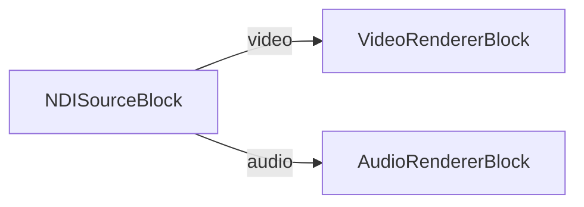

# Media Blocks SDK .Net - Reproductor NDI (C#/Android)

Recibe un flujo de vídeo y audio NDI en Android utilizando el SDK oficial NDI Advanced (`libndi.so`) y la canalización VisioForge Media Blocks.

## Bloques multimedia utilizados

* `NDISourceBlock` — Fuente NDI
* `VideoRendererBlock` — Visualización de vídeo en tiempo real
* `AudioRendererBlock` — Reproducción de audio en tiempo real

## Canalización



## Requisitos en tiempo de ejecución — NDI Advanced SDK para Android

Esta demostración se enlaza con `libndi.so` del **NDI Advanced SDK para Android**. El SDK es un producto comercial distribuido por Vizrt bajo el NDI SDK License Agreement — **no** se redistribuye con este repositorio.

1. Descargue el **NDI Advanced SDK (Android)**, versión 6 o superior, desde <https://ndi.video/sdk/>. Es obligatorio el SDK Advanced (el "NDI SDK for Android" estándar no contiene la `libndi.so` estática). Probado con NDI 6 SDK (Android).
2. Instálelo / extráigalo. La ruta predeterminada de instalación en Windows es:

   ```text
   C:\Program Files\NDI\NDI 6 SDK (Android)\
   ```

3. Dentro del SDK instalado, las bibliotecas nativas por ABI se ubican en `Lib\<abi>\libndi.so`. El csproj las recoge desde `$(NdiAndroidSdkLib)\<abi>\libndi.so` para estas ABI:
   * `arm64-v8a` — necesaria para teléfonos / tabletas modernos (recomendada)
   * `armeabi-v7a` — dispositivos ARM de 32 bits más antiguos
   * `x86_64` — emulador de Android en hosts x64
   * `x86` — emuladores x86 antiguos

### Cómo indicarle a la compilación dónde está el SDK

Orden de resolución (gana la primera coincidencia):

1. Propiedad MSBuild `NdiAndroidSdkLib` pasada en la línea de comandos:

   ```bash
   dotnet build -p:NdiAndroidSdkLib="D:\sdks\NDI 6 SDK (Android)\Lib"
   ```

2. Variable de entorno `NDI_ANDROID_SDK_LIB`:

   ```bash
   set NDI_ANDROID_SDK_LIB=D:\sdks\NDI 6 SDK (Android)\Lib
   dotnet build NDIPlayer.csproj
   ```

3. Ruta predeterminada `C:\Program Files\NDI\NDI 6 SDK (Android)\Lib`.

La ruta que indique debe apuntar al directorio `Lib` (el que contiene las subcarpetas por ABI), **no** a la raíz del SDK.

### Qué ocurre si falta `libndi.so`

* El csproj sólo añade un elemento `AndroidNativeLibrary` para una ABI cuando su `libndi.so` existe realmente en la ruta resuelta — los archivos faltantes se omiten silenciosamente para que el proyecto siempre compile.
* Para cada ABI faltante, la compilación emite una **advertencia** de MSBuild similar a:

  > `NDI Android SDK libndi.so not found for arm64-v8a at 'C:\Program Files\NDI\NDI 6 SDK (Android)\Lib\arm64-v8a\libndi.so'. The APK will build without it and NDI calls will throw DllNotFoundException at runtime on this ABI. Set NdiAndroidSdkLib (MSBuild property) or NDI_ANDROID_SDK_LIB (env var) to the NDI 6 Android SDK Lib directory to fix.`

* Si despliega el APK resultante en un dispositivo cuya ABI es una de las faltantes, la primera llamada al receptor / buscador NDI falla rápidamente con `System.DllNotFoundException: libndi.so`. Añada las ABI faltantes y vuelva a compilar.

### Permisos de la aplicación

`AndroidManifest.xml` declara los siguientes — necesarios porque NDI utiliza descubrimiento mDNS/Bonjour y TCP unicast para el canal de datos sobre Wi-Fi local:

* `INTERNET`
* `ACCESS_NETWORK_STATE`
* `ACCESS_WIFI_STATE`
* `CHANGE_WIFI_MULTICAST_STATE`

Asegúrese de que el dispositivo esté en la misma LAN que el emisor NDI y de que ningún perfil "DNS privado" / VPN bloquee el multicast mDNS en `224.0.0.251:5353`.

## Marco de trabajo compatible

* .NET 10 (`net10.0-android`), `minSdk` 28

## Licencia

El NDI Advanced SDK se rige por el Acuerdo de Licencia de SDK NDI de Vizrt. Debe aceptar dicho acuerdo antes de descargar o distribuir `libndi.so` con su aplicación. Este proyecto de demostración no concede ningún derecho de redistribución del runtime NDI.

---

[Visite la página del producto.](https://www.visioforge.com/media-blocks-sdk)
