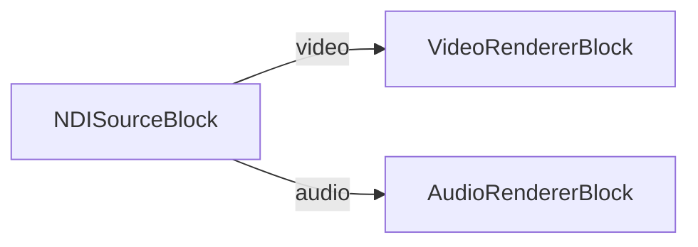

# Media Blocks SDK .Net - NDI Player (C#/Android)

Receives an NDI video+audio stream on Android using the official NDI Advanced SDK (`libndi.so`) and the VisioForge Media Blocks pipeline.

## Used media blocks

* `NDISourceBlock` — NDI source
* `VideoRendererBlock` — Real-time video display
* `AudioRendererBlock` — Real-time audio playback

## Pipeline



## Runtime prerequisites — NDI Advanced SDK for Android

This demo links against `libndi.so` from the **NDI Advanced SDK for Android**. The SDK is a commercial product distributed by Vizrt under the NDI SDK License Agreement — it is **not** redistributed with this repo.

1. Download the **NDI Advanced SDK (Android)**, version 6 or later, from <https://ndi.video/sdk/>. The Advanced SDK is required (the standard "NDI SDK for Android" does not contain the static `libndi.so`). Tested with NDI 6 SDK (Android).
2. Install / extract it. The default Windows install path is:

   ```text
   C:\Program Files\NDI\NDI 6 SDK (Android)\
   ```

3. Inside the SDK install, the per-ABI native libraries live under `Lib\<abi>\libndi.so`. The csproj picks them up from `$(NdiAndroidSdkLib)\<abi>\libndi.so` for these ABIs:
   * `arm64-v8a` — required for modern phones / tablets (recommended)
   * `armeabi-v7a` — older 32-bit ARM devices
   * `x86_64` — Android emulator on x64 hosts
   * `x86` — older x86 emulators

### Telling the build where the SDK is

Resolution order (first match wins):

1. MSBuild property `NdiAndroidSdkLib` passed on the command line:

   ```bash
   dotnet build -p:NdiAndroidSdkLib="D:\sdks\NDI 6 SDK (Android)\Lib"
   ```

2. Environment variable `NDI_ANDROID_SDK_LIB`:

   ```bash
   set NDI_ANDROID_SDK_LIB=D:\sdks\NDI 6 SDK (Android)\Lib
   dotnet build NDIPlayer.csproj
   ```

3. Default path `C:\Program Files\NDI\NDI 6 SDK (Android)\Lib`.

The path you supply must point at the `Lib` directory (the one that contains the per-ABI subfolders), **not** at the SDK root.

### What happens if `libndi.so` is missing

* The csproj only adds an `AndroidNativeLibrary` item for an ABI when its `libndi.so` actually exists at the resolved path — missing files are silently skipped so the project always compiles.
* For each missing ABI the build emits an MSBuild **warning** like:

  > `NDI Android SDK libndi.so not found for arm64-v8a at 'C:\Program Files\NDI\NDI 6 SDK (Android)\Lib\arm64-v8a\libndi.so'. The APK will build without it and NDI calls will throw DllNotFoundException at runtime on this ABI. Set NdiAndroidSdkLib (MSBuild property) or NDI_ANDROID_SDK_LIB (env var) to the NDI 6 Android SDK Lib directory to fix.`

* If you ship the resulting APK to a device whose ABI is among the missing ones, the first call into the NDI receiver / finder fails fast with `System.DllNotFoundException: libndi.so`. Add the missing ABI(s) and rebuild.

### App permissions

The `AndroidManifest.xml` declares the following — required because NDI uses mDNS/Bonjour discovery and unicast TCP for the data channel over local Wi-Fi:

* `INTERNET`
* `ACCESS_NETWORK_STATE`
* `ACCESS_WIFI_STATE`
* `CHANGE_WIFI_MULTICAST_STATE`

Make sure the device is on the same LAN as the NDI sender, and that any "Private DNS" / VPN profile is not blocking mDNS multicast on `224.0.0.251:5353`.

## Supported framework

* .NET 10 (`net10.0-android`), `minSdk` 28

## Licensing

The NDI Advanced SDK is governed by Vizrt's NDI SDK License Agreement. You must accept that agreement before downloading or shipping `libndi.so` with your app. This demo project does not grant any redistribution rights for the NDI runtime.

---

[Visit the product page.](https://www.visioforge.com/media-blocks-sdk)
