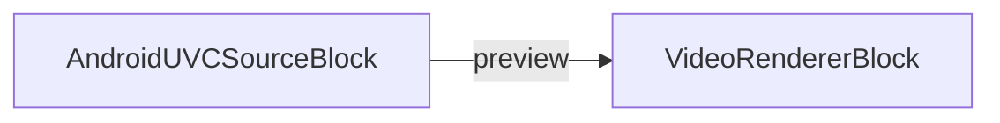

# Media Blocks SDK .Net - USB Camera (C#/Android)

This application shows a live preview from a USB (UVC) camera attached to an Android device over OTG,
such as a webcam or a capture dongle.

Such cameras are invisible to the regular `SystemVideoSourceBlock`, because Android only exposes them
through Camera2 on devices whose vendor ships the External Camera HAL - many, including Samsung, do
not. `AndroidUVCSourceBlock` reads the camera directly instead.

## Requirements

* An Android device with USB host (OTG) support.
* The `android.permission.CAMERA` permission, declared **and granted at runtime**. Android refuses to
  hand a USB video device to an app without it, even though the Android camera API is never used.
* Permission for the USB device itself, requested with `AndroidUVCDevices.RequestPermissionAsync`.

Note that a camera enumerating at USB 2.0 speed offers markedly lower frame rates than on a desktop:
a Logitech BRIO, for example, tops out at 1080p30 (MJPEG) with no 4K modes available at all.

## Used media blocks

* `AndroidUVCSourceBlock` - USB (UVC) camera capture
* `VideoRendererBlock` - Real-time video display

## Pipeline

## Supported frameworks

* .Net 10

---

[Visit the product page.](https://www.visioforge.com/media-blocks-sdk)
