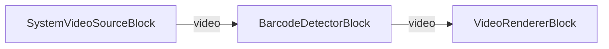

# Media Blocks SDK .Net - Lector de Codigos de Barras (C#/Avalonia)

Esta aplicacion multiplataforma de Avalonia demuestra la deteccion de codigos de barras y codigos QR en tiempo real desde una camara usando el VisioForge Media Blocks SDK.

## Bloques de medios utilizados

* `SystemVideoSourceBlock` - Captura de video de la camara
* `BarcodeDetectorBlock` - Deteccion de codigos de barras y QR en tiempo real
* `VideoRendererBlock` - Visualizacion de video en tiempo real

## Pipeline

## Frameworks soportados

* .Net 4.7.2
* .Net Core 3.1
* .Net 5
* .Net 6
* .Net 7
* .Net 8
* .Net 9
* .Net 10

---

[Visit the product page.](https://www.visioforge.com/media-blocks-sdk)
