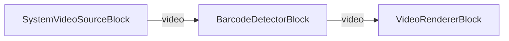

# Media Blocks SDK .Net - Barcode Reader (C#/Avalonia)

This cross-platform Avalonia application demonstrates real-time barcode and QR code detection from a camera using the VisioForge Media Blocks SDK.

## Used media blocks

* `SystemVideoSourceBlock` - Camera video capture
* `BarcodeDetectorBlock` - Real-time barcode and QR code detection
* `VideoRendererBlock` - Real-time video display

## Pipeline

## Supported frameworks

* .Net 4.7.2
* .Net Core 3.1
* .Net 5
* .Net 6
* .Net 7
* .Net 8
* .Net 9
* .Net 10

---

[Visit the product page.](https://www.visioforge.com/media-blocks-sdk)
