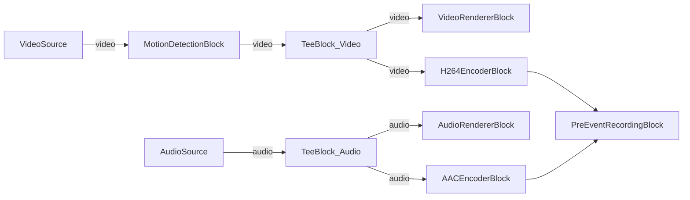

# Media Blocks SDK .Net - Grabacion Pre-Evento (C#/Avalonia)

Esta aplicacion multiplataforma demuestra la grabacion pre-evento (buffer continuo) con activacion por deteccion de movimiento. El video y audio se capturan de dispositivos locales, se codifican en H.264/AAC y se graban en archivos MP4 cuando ocurre un evento (activacion manual o deteccion de movimiento). El buffer pre-evento asegura que el metraje anterior a la activacion se incluya en la grabacion.

## Bloques de medios utilizados

* `SystemVideoSourceBlock` / `RTSPSourceBlock` - Fuente de video (camara o RTSP)
* `SystemAudioSourceBlock` - Captura de audio del microfono
* `MotionDetectionBlock` - Deteccion de movimiento por diferencia de cuadros
* `TeeBlock` - Division de flujo para vista previa y codificacion
* `VideoRendererBlock` - Vista previa de video en tiempo real
* `AudioRendererBlock` - Reproduccion de audio en tiempo real
* `H264EncoderBlock` - Codificacion de video H.264/AVC
* `AACEncoderBlock` - Codificacion de audio AAC
* `PreEventRecordingBlock` - Buffer continuo con grabacion MP4 activada por evento

## Pipeline

## Frameworks soportados

* .Net 4.7.2
* .Net Core 3.1
* .Net 5
* .Net 6
* .Net 7
* .Net 8
* .Net 9
* .Net 10

---

[Visit the product page.](https://www.visioforge.com/media-blocks-sdk)
