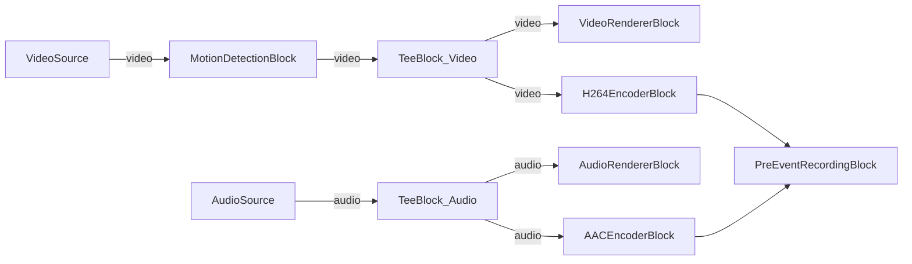

# Media Blocks SDK .Net - Pre-Event Recording (C#/Avalonia)

This cross-platform application demonstrates pre-event (continuous buffering) recording with motion detection trigger. Video and audio are captured from local devices, encoded to H.264/AAC, and recorded to MP4 files when an event (manual trigger or motion detection) occurs. The pre-event buffer ensures footage before the trigger is included in the recording.

## Used media blocks

* `SystemVideoSourceBlock` / `RTSPSourceBlock` - Video source (camera or RTSP)
* `SystemAudioSourceBlock` - Microphone audio capture
* `MotionDetectionBlock` - Frame-differencing motion detection
* `TeeBlock` - Stream splitting for preview and encoding paths
* `VideoRendererBlock` - Real-time video preview
* `AudioRendererBlock` - Real-time audio playback
* `H264EncoderBlock` - H.264/AVC video encoding
* `AACEncoderBlock` - AAC audio encoding
* `PreEventRecordingBlock` - Continuous buffer with event-triggered MP4 recording

## Pipeline

## Supported frameworks

* .Net 4.7.2
* .Net Core 3.1
* .Net 5
* .Net 6
* .Net 7
* .Net 8
* .Net 9
* .Net 10

---

[Visit the product page.](https://www.visioforge.com/media-blocks-sdk)
