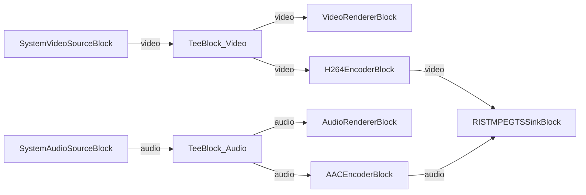

# Media Blocks SDK .Net - RIST Streamer (C#/Avalonia)

Esta aplicación multiplataforma captura video y audio de dispositivos locales, los codifica en H.264/AAC y los transmite mediante el protocolo RIST (Reliable Internet Stream Transport) usando MPEG-TS.

## Bloques de medios utilizados

* `SystemVideoSourceBlock` - Camera video capture
* `SystemAudioSourceBlock` - Microphone audio capture
* `VideoRendererBlock` - Real-time video preview
* `AudioRendererBlock` - Real-time audio playback
* `TeeBlock` - Stream splitting for preview and encoding paths
* `H264EncoderBlock` - H.264/AVC video encoding
* `AACEncoderBlock` - AAC audio encoding
* `RISTMPEGTSSinkBlock` - RIST MPEG-TS streaming output

## Pipeline

## Frameworks soportados

* .Net 4.7.2
* .Net Core 3.1
* .Net 5
* .Net 6
* .Net 7
* .Net 8
* .Net 9
* .Net 10

---

[Visit the product page.](https://www.visioforge.com/media-blocks-sdk)
