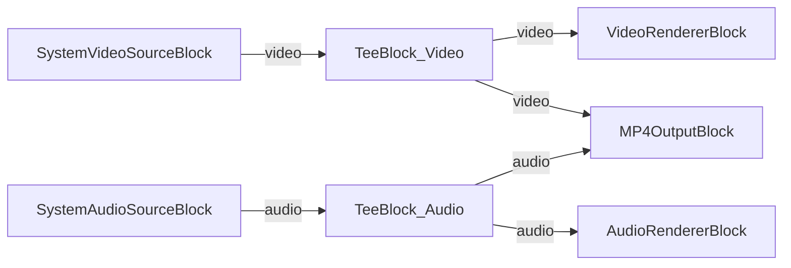

# Media Blocks SDK .Net - Captura de Video Simple (C#/Avalonia)

Esta aplicacion captura video y audio de dispositivos locales con grabacion opcional a archivo MP4.

## Bloques de medios utilizados

* `SystemVideoSourceBlock` - Captura de video de la camara
* `SystemAudioSourceBlock` - Captura de audio del microfono
* `TeeBlock` - Division de flujo para vista previa y grabacion
* `VideoRendererBlock` - Visualizacion de video en tiempo real
* `AudioRendererBlock` - Reproduccion de audio en tiempo real
* `MP4OutputBlock` - Salida de grabacion a archivo MP4

## Pipeline

## Frameworks soportados

* .Net 4.7.2
* .Net Core 3.1
* .Net 5
* .Net 6
* .Net 7
* .Net 8
* .Net 9
* .Net 10

---

[Visit the product page.](https://www.visioforge.com/media-blocks-sdk)
