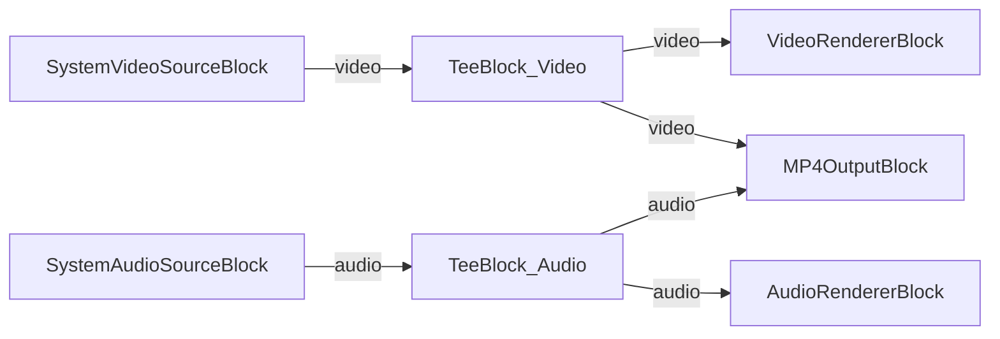

# Media Blocks SDK .Net - Simple Video Capture (C#/Avalonia)

This application captures video and audio from local devices with optional recording to MP4 file.

## Used media blocks

* `SystemVideoSourceBlock` - Camera video capture
* `SystemAudioSourceBlock` - Microphone audio capture
* `TeeBlock` - Stream splitting for preview and recording paths
* `VideoRendererBlock` - Real-time video display
* `AudioRendererBlock` - Real-time audio playback
* `MP4OutputBlock` - MP4 file recording output

## Pipeline

## Supported frameworks

* .Net 4.7.2
* .Net Core 3.1
* .Net 5
* .Net 6
* .Net 7
* .Net 8
* .Net 9
* .Net 10

---

[Visit the product page.](https://www.visioforge.com/media-blocks-sdk)
