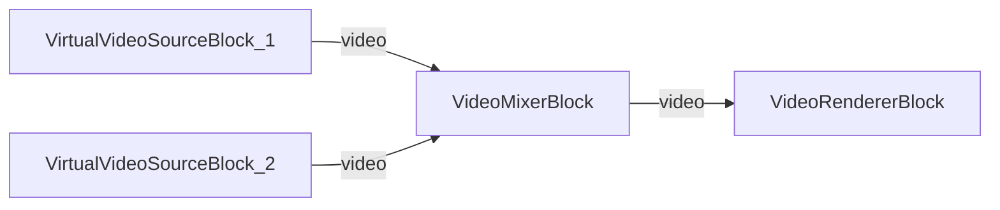

# Media Blocks SDK .Net - Mezclador de Video MVVM (C#/Avalonia)

Esta aplicacion multiplataforma demuestra la mezcla de video picture-in-picture (PiP) usando dos fuentes de video virtuales compuestas a traves de un mezclador de video y renderizadas en una sola salida, usando el patron MVVM.

## Bloques de medios utilizados

* `VirtualVideoSourceBlock` - Fuente de video virtual (generador de patron de prueba)
* `VideoMixerBlock` - Composicion de video / mezclador picture-in-picture
* `VideoRendererBlock` - Visualizacion de video en tiempo real

## Pipeline

## Frameworks soportados

* .Net 4.7.2
* .Net Core 3.1
* .Net 5
* .Net 6
* .Net 7
* .Net 8
* .Net 9
* .Net 10

---

[Visit the product page.](https://www.visioforge.com/media-blocks-sdk)
