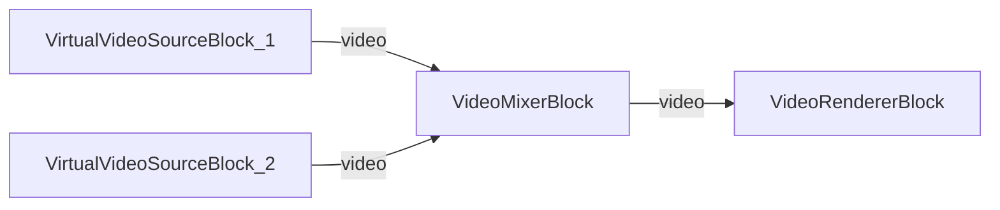

# Media Blocks SDK .Net - Video Mixer MVVM (C#/Avalonia)

This cross-platform application demonstrates picture-in-picture (PiP) video mixing using two virtual video sources composited through a video mixer and rendered to a single output, using the MVVM pattern.

## Used media blocks

* `VirtualVideoSourceBlock` - Virtual video source (test pattern generator)
* `VideoMixerBlock` - Video compositing / picture-in-picture mixer
* `VideoRendererBlock` - Real-time video display

## Pipeline

## Supported frameworks

* .Net 4.7.2
* .Net Core 3.1
* .Net 5
* .Net 6
* .Net 7
* .Net 8
* .Net 9
* .Net 10

---

[Visit the product page.](https://www.visioforge.com/media-blocks-sdk)
