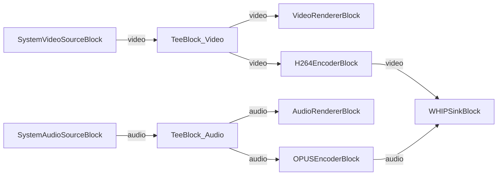

# Media Blocks SDK .Net - WebRTC WHIP Streamer (C#/Avalonia)

This cross-platform application captures video and audio from local devices, encodes them to H.264/Opus, and streams via WebRTC using the WHIP (WebRTC-HTTP Ingestion Protocol) with optional STUN server and authentication token support.

## Used media blocks

* `SystemVideoSourceBlock` - Camera video capture
* `SystemAudioSourceBlock` - Microphone audio capture
* `VideoRendererBlock` - Real-time video preview
* `AudioRendererBlock` - Real-time audio playback
* `TeeBlock` - Stream splitting for preview and encoding paths
* `H264EncoderBlock` - H.264/AVC video encoding
* `OPUSEncoderBlock` - Opus audio encoding
* `WHIPSinkBlock` - WebRTC WHIP streaming output

## Pipeline

## Supported frameworks

* .Net 4.7.2
* .Net Core 3.1
* .Net 5
* .Net 6
* .Net 7
* .Net 8
* .Net 9
* .Net 10

---

[Visit the product page.](https://www.visioforge.com/media-blocks-sdk)
