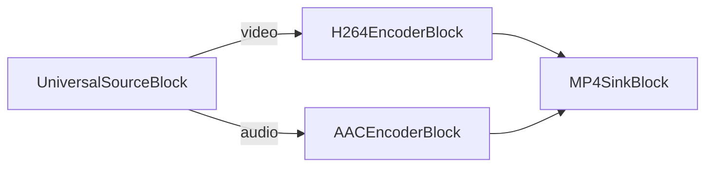

# Media Blocks SDK .Net - FileConvert (C#/Console)

Esta aplicación reproduce archivos multimedia usando el decodificador universal, guarda la salida en formato MP4.

## Bloques de medios utilizados

* `UniversalSourceBlock` - Universal media file playback
* `H264EncoderBlock` - H.264/AVC video encoding
* `AACEncoderBlock` - AAC audio encoding
* `MP4SinkBlock` - MP4 file output

## Pipeline

## Frameworks soportados

* .Net 4.7.2
* .Net Core 3.1
* .Net 5
* .Net 6
* .Net 7
* .Net 8
* .Net 9
* .Net 10

---

[Visit the product page.](https://www.visioforge.com/media-blocks-sdk)
