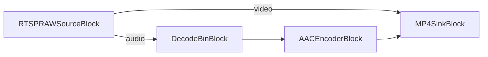

# Media Blocks SDK .Net - RTSP Capture Original (C#/Console)

This application saves output to MP4 format.

## Used media blocks

* `AACEncoderBlock` - AAC audio encoding
* `MP4SinkBlock` - MP4 file output

## Pipeline

## Supported frameworks

* .Net 4.7.2
* .Net Core 3.1
* .Net 5
* .Net 6
* .Net 7
* .Net 8
* .Net 9
* .Net 10

---

[Visit the product page.](https://www.visioforge.com/media-blocks-sdk)
