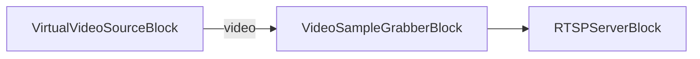

# Media Blocks SDK .Net - Servidor RTSP de Imágenes (C#/Consola)

Esta aplicación demuestra la transmisión de imágenes a través de RTSP utilizando el SDK VisioForge Media Blocks.

## Descripción

Esta aplicación de consola crea un servidor RTSP que transmite una secuencia de 5 imágenes JPG en un bucle infinito. Cada imagen se muestra durante 1 segundo antes de pasar a la siguiente imagen.

La aplicación utiliza `VirtualVideoSourceBlock` para generar una transmisión de video a 25 FPS, y `VideoSampleGrabberBlock` para interceptar cada fotograma y reemplazarlo con una imagen personalizada cargada desde el disco. Los fotogramas modificados se codifican con H.264 y se transmiten a través de RTSP.

## Características

* VirtualVideoSourceBlock genera la transmisión de video
* VideoSampleGrabberBlock intercepta y reemplaza fotogramas con imágenes personalizadas
* Servidor RTSP para transmisión en red
* Reproducción en bucle infinito con 1 segundo por imagen
* Codificación de video H.264
* Admite imágenes JPG personalizadas (colóquelas en la carpeta Images)

## Bloques multimedia utilizados

* `VirtualVideoSourceBlock` - Genera una transmisión de video con patrón de prueba
* `VideoSampleGrabberBlock` - Intercepta fotogramas y los reemplaza con imágenes personalizadas
* `H264EncoderBlock` - Codificación de video H.264/AVC (a través de RTSPServerBlock)
* `RTSPServerBlock` - Servidor de transmisión RTSP

## Cómo usar

1. Ejecute la aplicación
2. La aplicación generará 5 imágenes de prueba en la carpeta `Images` si no existen
3. Conéctese a la transmisión RTSP usando un reproductor multimedia (por ejemplo, VLC, ffplay)
   - URL predeterminada: `rtsp://localhost:8554/stream`
4. Presione cualquier tecla para detener el servidor

## Visualización de la transmisión

Puede ver la transmisión RTSP usando:

### VLC Media Player
```
vlc rtsp://localhost:8554/stream
```

### ffplay
```
ffplay -rtsp_transport tcp rtsp://localhost:8554/stream
```

### GStreamer
```
gst-launch-1.0 rtspsrc location=rtsp://localhost:8554/stream ! decodebin ! autovideosink
```

## Configuración

1. Coloque sus imágenes JPG en la carpeta `Images` (junto al ejecutable)
2. Nómbrelas `image1.jpg`, `image2.jpg`, `image3.jpg`, `image4.jpg`, `image5.jpg`
3. Ejecute la aplicación - transmitirá sus imágenes en secuencia
4. Los archivos de imagen vacíos o no válidos se reemplazarán con marcadores de posición negros

## Pipeline



## Frameworks compatibles

* .Net Framework 4.7.2
* .Net 5 and later
* .Net 10

## Plataformas compatibles

* Windows (x64)
* Linux (x64)
* macOS (ARM64, x64)

---

[Visite la página del producto.](https://www.visioforge.com/media-blocks-sdk)
