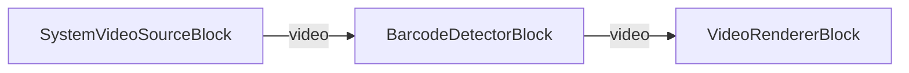

# VisioForge Media Blocks SDK .NET

## Barcode Reader Demo (MAUI)

Esta aplicación multiplataforma MAUI demuestra la detección de códigos de barras y códigos QR en tiempo real usando el VisioForge Media Blocks SDK.

## Características

- **Detección de códigos de barras en tiempo real**: Escanea códigos de barras y códigos QR usando la cámara del dispositivo
- **Multiplataforma**: Funciona en Windows, Android, iOS y macOS
- **Múltiples formatos de códigos de barras**: Soporta códigos QR, DataMatrix, Code128, Code39, EAN-13, UPC-A y más
- **Detección de duplicados**: Previene múltiples detecciones del mismo código de barras en 2 segundos
- **Vista previa de video en vivo**: Visualiza la cámara mientras escanea
- **Selección de cámara**: Cambia entre múltiples cámaras si están disponibles
- **Contador de detecciones**: Rastrea el número de códigos de barras detectados

## Formatos de códigos de barras soportados

### Códigos de barras 2D
- QR Code
- DataMatrix
- PDF417
- Aztec

### Códigos de barras 1D
- Code 128
- Code 39
- EAN-13 / EAN-8
- UPC-A / UPC-E
- Codabar
- ITF (Interleaved 2 of 5)

## Requisitos

- .NET 9
- Plataformas soportadas:
  - Windows 10 (19041) o posterior
  - Android 6.0 (API 23) o posterior
  - iOS 15.0 o posterior
  - macOS 12.0 o posterior (vía Mac Catalyst)
- VisioForge Media Blocks SDK

## Cómo usar

1. **Iniciar la aplicación**: Inicie la aplicación en su dispositivo
2. **Otorgar permiso de cámara**: Permita el acceso a la cámara cuando se solicite (requerido en móvil)
3. **Seleccionar cámara** (opcional): Si tiene múltiples cámaras, toque "SELECT CAMERA" para cambiar entre ellas
4. **Iniciar escaneo**: Toque el botón "START" para comenzar a escanear
5. **Escanear códigos de barras**: Apunte su cámara a cualquier código de barras o código QR
6. **Ver resultados**: Los códigos de barras detectados aparecen en la parte inferior mostrando:
   - Tipo de código de barras (ej. "QR Code", "EAN-13")
   - Valor decodificado
   - Conteo total de detecciones
7. **Detener escaneo**: Toque el botón "STOP" cuando termine

## Detalles de implementación

### Arquitectura del pipeline

La demostración usa la arquitectura de pipeline del Media Blocks SDK:

```
[SystemVideoSourceBlock] → [BarcodeDetectorBlock] → [VideoRendererBlock]
```

- **SystemVideoSourceBlock**: Captura video de la cámara
- **BarcodeDetectorBlock**: Detecta y decodifica códigos de barras en tiempo real
- **VideoRendererBlock**: Muestra la vista previa del video

### Implementación de características clave

**Prevención de detección de duplicados**:
```csharp
private Dictionary<string, DateTime> _recentDetections = new();
private TimeSpan _deduplicationWindow = TimeSpan.FromSeconds(2);
```

**Manejo de eventos**:
```csharp
_barcodeDetector.OnBarcodeDetected += BarcodeDetector_OnBarcodeDetected;
```

**Permisos multiplataforma**:
```csharp
#if __ANDROID__ || __MACOS__ || __MACCATALYST__
    await RequestCameraPermissionAsync();
#endif
```

## Notas específicas por plataforma

### Android
- El permiso de cámara se solicita en tiempo de ejecución
- Requiere permiso `CAMERA` en AndroidManifest.xml
- Funciona en dispositivos físicos y emuladores con soporte de cámara

### iOS / macOS
- Se requiere descripción de uso de cámara en Info.plist
- Permiso de cámara solicitado en tiempo de ejecución
- Se requieren Entitlements para macOS

### Windows
- No se requieren permisos especiales
- Funciona con cámaras web integradas y cámaras USB externas

## Compilación y ejecución

### Desde Visual Studio
1. Abra la solución en Visual Studio 2022
2. Seleccione su plataforma objetivo (Windows, Android, iOS, etc.)
3. Compile y ejecute

### Desde línea de comandos
```bash
# Para Windows
dotnet build -f net9.0-windows10.0.19041.0

# Para Android
dotnet build -f net9.0-android

# Para iOS
dotnet build -f net9.0-ios

# Para macOS
dotnet build -f net9.0-maccatalyst
```

## Solución de problemas

### Códigos de barras no detectados
- Asegúrese de tener iluminación adecuada
- Verifique el enfoque de la cámara (permita tiempo para enfocar)
- Mantenga el código de barras dentro del marco de la cámara
- Intente ajustar la distancia (15-30cm típicamente óptimo)

### Permiso de cámara denegado
- Verifique la configuración del dispositivo para habilitar el permiso de cámara
- Reinicie la aplicación después de otorgar el permiso

### Problemas de rendimiento
- Cierre otras aplicaciones
- Reduzca la resolución de la cámara si es necesario
- Asegúrese de que el dispositivo cumpla con los requisitos mínimos

## Recursos relacionados

- [Barcode Reader Guide](../../../../HELP/dotnet/mediablocks/Guides/barcode-qr-reader-guide.md)
- [Media Blocks SDK Documentation](../../../../HELP/dotnet/mediablocks/)
- [VisioForge Website](https://www.visioforge.com/)

## Pipeline



## Frameworks soportados

- .NET 9
- .NET 10

---

[Visit the product page.](https://www.visioforge.com/media-blocks-sdk)
