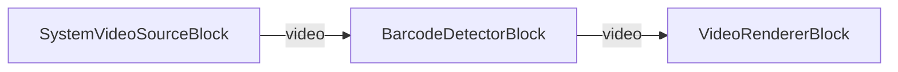

# VisioForge Media Blocks SDK .NET

## Barcode Reader Demo (MAUI)

This cross-platform MAUI application demonstrates real-time barcode and QR code detection using the VisioForge Media Blocks SDK.

## Features

- **Real-time Barcode Detection**: Scan barcodes and QR codes using device camera
- **Cross-Platform**: Works on Windows, Android, iOS, and macOS
- **Multiple Barcode Formats**: Supports QR codes, DataMatrix, Code128, Code39, EAN-13, UPC-A, and more
- **Duplicate Detection**: Prevents multiple detections of the same barcode within 2 seconds
- **Live Video Preview**: See camera feed while scanning
- **Camera Selection**: Switch between multiple cameras if available
- **Detection Counter**: Track number of barcodes detected

## Supported Barcode Formats

### 2D Barcodes
- QR Code
- DataMatrix
- PDF417
- Aztec

### 1D Barcodes
- Code 128
- Code 39
- EAN-13 / EAN-8
- UPC-A / UPC-E
- Codabar
- ITF (Interleaved 2 of 5)

## Requirements

- .NET 9
- Supported platforms:
  - Windows 10 (19041) or later
  - Android 6.0 (API 23) or later
  - iOS 15.0 or later
  - macOS 12.0 or later (via Mac Catalyst)
- VisioForge Media Blocks SDK

## How to Use

1. **Launch the Application**: Start the app on your device
2. **Grant Camera Permission**: Allow camera access when prompted (required on mobile)
3. **Select Camera** (optional): If you have multiple cameras, tap "SELECT CAMERA" to cycle through them
4. **Start Scanning**: Tap the "START" button to begin scanning
5. **Scan Barcodes**: Point your camera at any barcode or QR code
6. **View Results**: Detected barcodes appear at the bottom showing:
   - Barcode type (e.g., "QR Code", "EAN-13")
   - Decoded value
   - Total detection count
7. **Stop Scanning**: Tap the "STOP" button when done

## Implementation Details

### Pipeline Architecture

The demo uses the Media Blocks SDK pipeline architecture:

```
[SystemVideoSourceBlock] → [BarcodeDetectorBlock] → [VideoRendererBlock]
```

- **SystemVideoSourceBlock**: Captures video from camera
- **BarcodeDetectorBlock**: Detects and decodes barcodes in real-time
- **VideoRendererBlock**: Displays the video preview

### Key Features Implementation

**Duplicate Detection Prevention**:
```csharp
private Dictionary<string, DateTime> _recentDetections = new();
private TimeSpan _deduplicationWindow = TimeSpan.FromSeconds(2);
```

**Event Handling**:
```csharp
_barcodeDetector.OnBarcodeDetected += BarcodeDetector_OnBarcodeDetected;
```

**Cross-Platform Permissions**:
```csharp
#if __ANDROID__ || __MACOS__ || __MACCATALYST__
    await RequestCameraPermissionAsync();
#endif
```

## Platform-Specific Notes

### Android
- Camera permission is requested at runtime
- Requires `CAMERA` permission in AndroidManifest.xml
- Works on physical devices and emulators with camera support

### iOS / macOS
- Camera usage description required in Info.plist
- Camera permission requested at runtime
- Entitlements required for macOS

### Windows
- No special permissions required
- Works with built-in webcams and external USB cameras

## Building and Running

### From Visual Studio
1. Open the solution in Visual Studio 2022
2. Select your target platform (Windows, Android, iOS, etc.)
3. Build and run

### From Command Line
```bash
# For Windows
dotnet build -f net9.0-windows10.0.19041.0

# For Android
dotnet build -f net9.0-android

# For iOS
dotnet build -f net9.0-ios

# For macOS
dotnet build -f net9.0-maccatalyst
```

## Troubleshooting

### Barcodes Not Detected
- Ensure adequate lighting
- Check camera focus (allow time to focus)
- Hold barcode within camera frame
- Try adjusting distance (15-30cm typically optimal)

### Camera Permission Denied
- Check device settings to enable camera permission
- Restart the app after granting permission

### Performance Issues
- Close other applications
- Reduce camera resolution if needed
- Ensure device meets minimum requirements

## Related Resources

- [Barcode Reader Guide](../../../../HELP/dotnet/mediablocks/Guides/barcode-qr-reader-guide.md)
- [Media Blocks SDK Documentation](../../../../HELP/dotnet/mediablocks/)
- [VisioForge Website](https://www.visioforge.com/)

## Pipeline



## Supported Frameworks

- .NET 9
- .NET 10

---

[Visit the product page.](https://www.visioforge.com/media-blocks-sdk)
