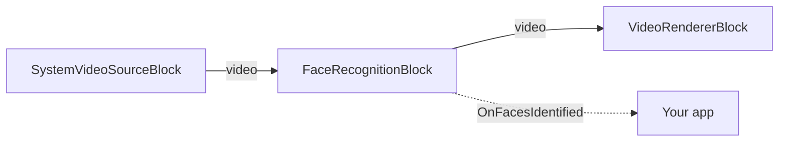

# VisioForge Media Blocks SDK .NET

## Face Recognition Demo (MAUI)

This cross-platform MAUI application demonstrates real-time face recognition (face identity) on a live
camera feed using the VisioForge Media Blocks SDK and the `FaceRecognitionBlock`. It detects faces,
turns each into an embedding, and matches it 1:N against an enrolled gallery.

## Features

- **Face identity**: Recognizes enrolled people on the live camera and draws their names on the video.
- **Embedding model**: Pick **SFace (128-D)** or **AuraFace (512-D, ArcFace family)** with the **Embedder** button. Switching re-embeds the enrolled photos automatically so the gallery always matches the running model.
- **Enrollment**: Add people from photos picked from the device gallery; save/load the gallery to disk.
- **Camera or file**: Recognize on a live camera or on a picked video file, with a seek bar and a real-time / max-speed playback toggle for files.
- **Cross-Platform**: Works on Windows, Android, iOS, and macOS (Mac Catalyst).
- **On-device**: All inference runs locally through ONNX Runtime — no cloud.
- **Camera Selection**: Switch between multiple cameras if available.

## Models

The ONNX models are downloaded on first use (tap **DOWNLOAD MODELS**) and cached in the app data
directory. The detector and SFace embedder come from the [OpenCV Zoo](https://github.com/opencv/opencv_zoo)
and are designed to work together (SFace aligns with YuNet's five landmarks):

- `face_detection_yunet_2023mar.onnx` — YuNet face detector (MIT).
- `face_recognition_sface_2021dec.onnx` — SFace face embedding (Apache-2.0, 128-D).
- `face_recognition_auraface_v1.onnx` — AuraFace embedding (Apache-2.0, 512-D, ArcFace family, by fal) — higher accuracy at a larger size (~261 MB) and heavier CPU cost on mobile. Selected via the **Embedder** button.

A gallery is only comparable to embeddings from the same model, so keep one gallery per embedder.
Model weights are **not** shipped in the SDK NuGet packages.

## How to Use

1. **Launch the app** and grant camera (and photo) permission when prompted.
2. **Pick the embedder** (optional): tap the **Embedder** button to switch between SFace (128-D) and
   AuraFace (512-D). **Download models** for the selected embedder.
3. **Enroll people**: type a name, tap **ENROLL PHOTO**, and pick a clear, front-facing photo. Repeat
   per person. Tap **SAVE** to persist the gallery and **LOAD** to restore it later. Switching the
   embedder re-embeds the enrolled photos automatically (a loaded gallery without its source photos
   can't be rebuilt — re-enroll).
4. **Pick the source**: tap **Source** to switch between **Camera** and **Video file**. For a file, tap
   **OPEN FILE**, then use the seek bar to scrub and the **Real time** switch to play in real time or as
   fast as possible.
5. **Recognize**: tap **START**. Enrolled people are named over the video; the status line shows the
   face count and the best match. Unknown faces are labeled `Unknown`.

## Pipeline



## Building and Running

```bash
# Windows
dotnet build -f net10.0-windows10.0.19041.0

# Android
dotnet build -f net10.0-android

# iOS
dotnet build -f net10.0-ios

# macOS (Mac Catalyst)
dotnet build -f net10.0-maccatalyst
```

## Privacy

Face recognition processes biometric data. Ensure your use complies with the applicable privacy and
data-protection laws (GDPR, BIPA, CCPA, and similar) in your jurisdiction.

---

[Visit the product page.](https://www.visioforge.com/media-blocks-sdk)
