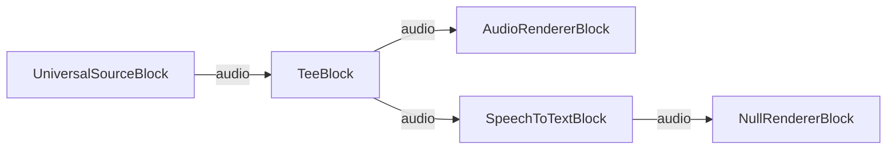

# VisioForge Media Blocks SDK .NET

## Live Subtitles Demo (MAUI)

This cross-platform MAUI application transcribes the audio of a media file into subtitles
**fully on-device** using OpenAI Whisper (Whisper.net / GGML) with Silero VAD voice-activity
detection. No camera and no cloud service are used — audio never leaves the device.

## Features

- **On-device speech-to-text**: Whisper runs locally; nothing is sent to a server.
- **Silero VAD**: voice-activity detection trims silence so only speech is transcribed.
- **Auto language detection**: Whisper detects the spoken language automatically.
- **Cross-platform**: Windows, Android, iOS, and macOS (Mac Catalyst).
- **Real-time playback**: the file plays at 1x through the speakers and the caption follows the words.
  Switch it off to transcribe the file as fast as Whisper can, with no audible playback.
- **Live subtitle log**: recognized lines accumulate as `[mm:ss] text` in a scrollable area.

## Models

No model files are bundled. On the first run the app downloads:

- **Whisper base GGML model** (~150 MB) via `WhisperGgmlDownloader`.
- **Silero VAD** ONNX model (MIT) from the official repository.

Both are cached under the app data directory and reused on subsequent runs. The first
transcription therefore takes longer while the Whisper model downloads.

## How to Use

1. Launch the app.
2. Pick a Whisper model and leave **Real-time playback** on (turn it off for fastest transcription).
3. Tap **PICK FILE & TRANSCRIBE**. On the first run the model downloads (status shows progress).
4. Pick any media file with an audio track (mp4 / mkv / wav / mp3 / m4a / ...).
5. Watch the caption follow the audio, and the recognized lines accumulate in the scrollable area.
6. The pipeline stops automatically when the file ends, or tap **STOP** to stop early.

If the chosen file has no audio track, or the model download fails, the app shows an alert.

## Implementation Details

### Pipeline Architecture

Real-time playback ON — the audio is split, so an inference burst never stalls playback:

```
[UniversalSourceBlock (audio)] → [TeeBlock] → [AudioRendererBlock]                       (audible, 1x)
                                           → [SpeechToTextBlock] → [NullRendererBlock]   (IsSync = false)
```

Real-time playback OFF — nothing paces the pipeline, so it runs as fast as Whisper allows:

```
[UniversalSourceBlock (audio)] → [SpeechToTextBlock] → [NullRendererBlock]  (IsSync = false)
```

- **UniversalSourceBlock**: decodes the picked file, audio-only (`renderVideo: false`).
- **TeeBlock**: real-time mode only. Its transcriber leg carries a 10-second queue that absorbs an inference
  burst. It is deliberately not leaky: segment times come from a sample counter, so a dropped buffer would
  shift every later caption earlier. A machine that cannot keep up stutters the playback instead.
- **SpeechToTextBlock**: transcribes speech with Whisper + Silero VAD, raising `OnSpeechRecognized`
  for each recognized segment.
- **AudioRendererBlock**: plays the audio at 1x, which is what paces the pipeline in real-time mode.
- **NullRendererBlock**: terminates the transcriber leg without pacing it.

### Settings

```csharp
var settings = new SpeechToTextSettings(whisperModelPath)
{
    Language = "auto",
    Provider = OnnxExecutionProvider.Auto, // GPU when available, else CPU
    EnableVad = true,
};
settings.Vad.ModelPath = sileroModelPath;
```

`OnSpeechRecognized` is raised on the GStreamer streaming thread, so the demo marshals UI updates with
`Dispatcher.Dispatch`. The handler only feeds a `CaptionTimeline`; the existing position poll reads
`TextAt(position)` from it, so the caption appears when playback reaches it rather than the moment
Whisper finished it.

## Platform-Specific Notes

### Android

- The file picker handles storage access; no extra runtime permission is needed for picking.
- The base model download (~150 MB) needs network access and storage space.

### iOS / macOS

- The Mono interpreter is enabled (`UseInterpreter`) so Whisper.net's model downloader works
  under AOT.
- Allow the first-run model download to complete before transcribing.

### Windows

- No special permissions required.
- GPU execution is used automatically when available, otherwise CPU.

## Building and Running

```bash
# Windows
dotnet build -f net10.0-windows10.0.19041.0

# Android
dotnet build -f net10.0-android

# iOS
dotnet build -f net10.0-ios

# macOS (Mac Catalyst)
dotnet build -f net10.0-maccatalyst
```

## Pipeline



With real-time playback off, the `TeeBlock` and `AudioRendererBlock` are omitted and the source feeds
`SpeechToTextBlock` directly.

## Supported Frameworks

- .NET 10

---

[Visit the product page.](https://www.visioforge.com/media-blocks-sdk)
