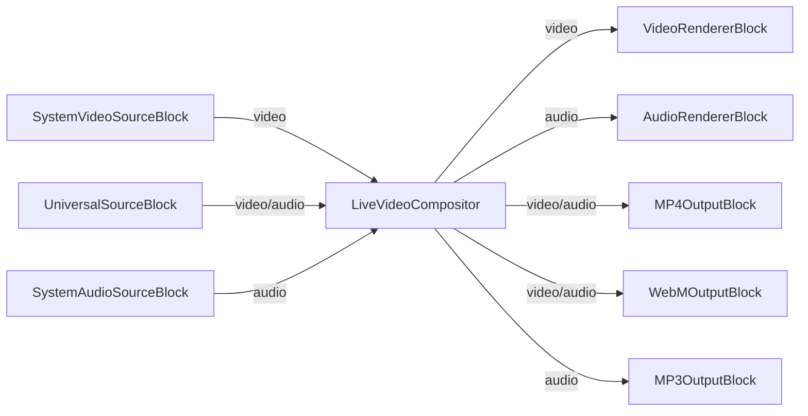

# Live Video Compositor MAUI Demo

This demo shows how to use the VisioForge Media Blocks SDK to create a live video compositor application in .NET MAUI.

## Features

- Real-time video and audio mixing from multiple sources
- Support for various input types:
  - Camera devices
  - Video/audio files
  - Audio devices
- Multiple output formats:
  - MP4 (H.264 + AAC)
  - WebM (VP8 + Vorbis)
  - MP3 (audio only)
- Dynamic source positioning with rectangle coordinates and Z-order
- Live preview with audio playback
- Cross-platform support (Windows, macOS, iOS, Android)

## Requirements

- .NET 8.0 or later
- VisioForge Media Blocks SDK
- Platform-specific dependencies as specified in the project file

## Usage

1. Launch the application
2. Select video resolution when prompted
3. Add input sources using the "Add" button in the Sources section
4. Configure source positioning using the rectangle settings
5. Add outputs using the "Add" button in the Outputs section
6. Click "Start" to begin compositing
7. Start/stop individual outputs as needed
8. Click "Stop" to end the compositing session

## Used media blocks

* `LiveVideoCompositor` - Real-time video and audio mixing
* `SystemVideoSourceBlock` - Camera device capture
* `UniversalSourceBlock` - Universal media file playback
* `SystemAudioSourceBlock` - Audio device capture
* `AudioRendererBlock` - Real-time audio playback
* `MP4OutputBlock` - MP4 file output (H.264 + AAC)
* `WebMOutputBlock` - WebM file output (VP8 + Vorbis)
* `MP3OutputBlock` - MP3 audio file output

## Pipeline

## Supported frameworks

* .Net 4.7.2
* .Net Core 3.1
* .Net 5
* .Net 6
* .Net 7
* .Net 8
* .Net 9
* .Net 10

## Platform Notes

- Screen capture functionality is platform-specific and may not be available on all platforms
- File outputs are saved to the application's data directory
- Some professional features (like Decklink support) are not available on mobile platforms

## License

This demo is part of the VisioForge Media Blocks SDK. Please refer to the VisioForge license agreement for usage terms.