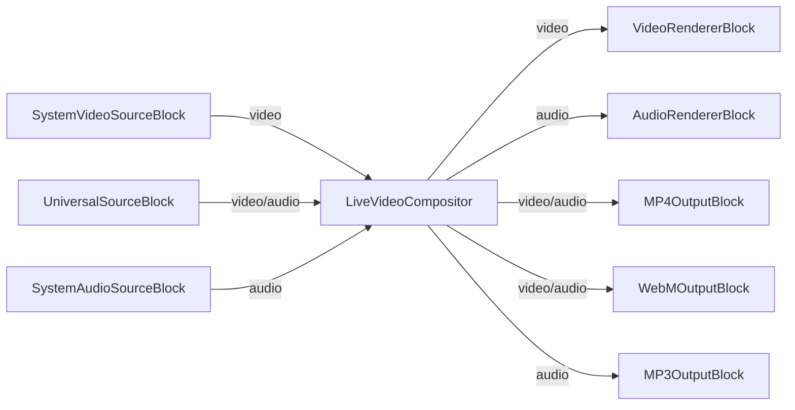

# Media Blocks SDK .Net - Live Video Compositor (C#/MAUI)

Esta aplicación reproduce archivos multimedia usando el decodificador universal, captura la salida de audio del sistema.

## Bloques de medios utilizados

* `LiveVideoCompositor` - Real-time video and audio mixing
* `SystemVideoSourceBlock` - Camera device capture
* `UniversalSourceBlock` - Universal media file playback
* `SystemAudioSourceBlock` - Audio device capture
* `AudioRendererBlock` - Real-time audio playback
* `MP4OutputBlock` - MP4 file output (H.264 + AAC)
* `WebMOutputBlock` - WebM file output (VP8 + Vorbis)
* `MP3OutputBlock` - MP3 audio file output

## Pipeline

## Frameworks soportados

* .Net 4.7.2
* .Net Core 3.1
* .Net 5
* .Net 6
* .Net 7
* .Net 8
* .Net 9
* .Net 10

---

[Visit the product page.](https://www.visioforge.com/media-blocks-sdk)
