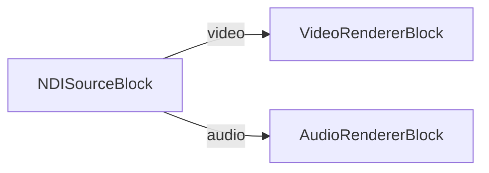

# Media Blocks SDK .Net - NDI Player (C#/MAUI)

Este ejemplo .NET MAUI descubre fuentes NDI en la red local y reproduce el flujo de video/audio seleccionado usando VisioForge Media Blocks SDK.

## Bloques multimedia usados

* `NDISourceBlock` - Entrada de flujo NDI
* `VideoRendererBlock` - Visualizacion de video en tiempo real
* `AudioRendererBlock` - Reproduccion de audio en tiempo real

## Pipeline



## SDK NDI para Android

La reproduccion en Android requiere `libndi.so` del NDI Advanced SDK for Android. El proyecto no redistribuye ese binario.

El proyecto resuelve la carpeta `Lib` del SDK en este orden:

1. Propiedad MSBuild `NdiAndroidSdkLib`
2. Variable de entorno `NDI_ANDROID_SDK_LIB`
3. `C:\Program Files\NDI\NDI 6 SDK (Android)\Lib`

Ejemplo:

```bash
dotnet build NDIPlayerMB.csproj -f net10.0-android -p:NdiAndroidSdkLib="D:\sdks\NDI 6 SDK (Android)\Lib"
```

Si falta `libndi.so` para una ABI, la compilacion de Android emite una advertencia y la app lanzara `DllNotFoundException` en tiempo de ejecucion en esa ABI.

## Framework soportado

* .NET 10 MAUI

---

[Visita la pagina del producto.](https://www.visioforge.com/media-blocks-sdk)
