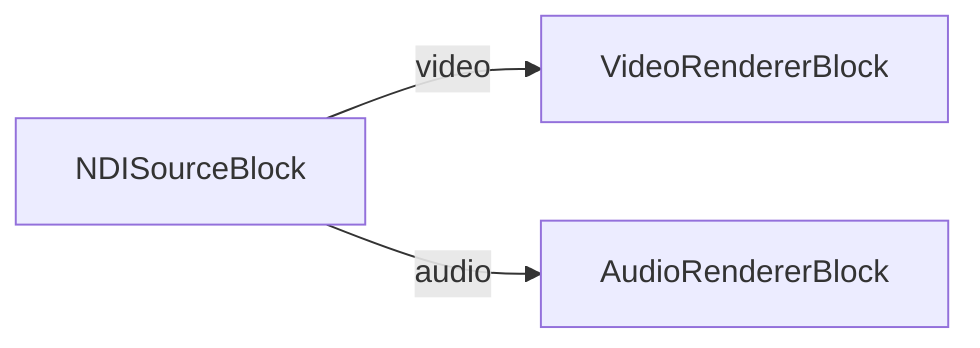

# Media Blocks SDK .Net - NDI Player (C#/MAUI)

This .NET MAUI sample discovers NDI sources on the local network and plays the selected video/audio stream using the VisioForge Media Blocks SDK.

## Used media blocks

* `NDISourceBlock` - NDI stream input
* `VideoRendererBlock` - Real-time video display
* `AudioRendererBlock` - Real-time audio playback

## Pipeline



## Android NDI SDK

Android playback requires `libndi.so` from the NDI Advanced SDK for Android. The project does not redistribute that binary.

The project resolves the SDK `Lib` folder in this order:

1. MSBuild property `NdiAndroidSdkLib`
2. Environment variable `NDI_ANDROID_SDK_LIB`
3. `C:\Program Files\NDI\NDI 6 SDK (Android)\Lib`

Example:

```bash
dotnet build NDIPlayerMB.csproj -f net10.0-android -p:NdiAndroidSdkLib="D:\sdks\NDI 6 SDK (Android)\Lib"
```

If an ABI-specific `libndi.so` is missing, the Android build emits a warning and the app will throw `DllNotFoundException` at runtime on that ABI.

## Supported framework

* .NET 10 MAUI

---

[Visit the product page.](https://www.visioforge.com/media-blocks-sdk)
