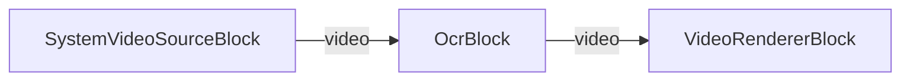

# VisioForge Media Blocks SDK .NET

## OCR Text Recognition Demo (MAUI)

This cross-platform MAUI application demonstrates real-time text recognition (OCR) on a live camera
feed using the VisioForge Media Blocks SDK.

The `OcrBlock` runs a multi-stage PaddleOCR (PP-OCR) pipeline on each processed frame: text detection,
optional 180-degree angle classification, and text-line recognition. Recognized regions are drawn into
the video frame, and the bottom status panel shows the number of detected regions and the first
recognized line.

## Bundled Models

The demo ships the Apache-2.0 licensed PP-OCRv5 mobile models plus the Latin character dictionary in
`Resources/Raw/` (bundled with the app and copied to app-data on first run):

- `ch_PP-OCRv5_mobile_det.onnx` — text detection (DBNet)
- `latin_PP-OCRv5_rec_mobile_infer.onnx` — Latin text recognition (CRNN/SVTR)
- `ch_ppocr_mobile_v2.0_cls_infer.onnx` — 180-degree angle classification
- `ppocrv5_latin_dict.txt` — recognizer character dictionary

OCR is heavier than single-model detection, so the demo sets `FramesToSkip = 5` to keep live video smooth.

## Pipeline

## How to Use

1. Launch the application on your device.
2. Grant camera permission when prompted (required on mobile).
3. Optionally tap "SELECT CAMERA" to cycle through available cameras.
4. Tap "START" to begin recognition.
5. Point the camera at printed or on-screen Latin text. Recognized regions are highlighted in the
   preview, and the status panel shows the region count and the first recognized line.
6. Tap "STOP" when done.

## Requirements

- .NET 10
- Supported platforms:
  - Windows 10 (19041) or later
  - Android 6.0 (API 23) or later
  - iOS 15.0 or later
  - macOS 12.0 or later (via Mac Catalyst)
- VisioForge Media Blocks SDK

## Supported Frameworks

- .NET 10

---

[Visit the product page.](https://www.visioforge.com/media-blocks-sdk)
