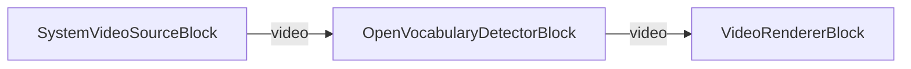

# VisioForge Media Blocks SDK .NET

## Open Vocabulary Detection Demo (MAUI)

This cross-platform MAUI application demonstrates real-time **open-vocabulary** object detection on a live camera feed using the VisioForge Media Blocks SDK. Unlike a fixed-class detector (YOLO), an open-vocabulary detector is queried with **free-text prompts** — type "a person, a car, a red backpack" and it detects exactly those, no retraining required.

## Features

- **Open-Vocabulary Detection**: Detect objects described by free text instead of a fixed class list.
- **Two Models**: OWLv2 (base, ensemble) and Grounding DINO (tiny), selectable from a picker.
- **Live Prompt Editing**: Change the comma-separated prompt list and tap **APPLY** to swap prompts on the running pipeline (via `OpenVocabularyDetectorBlock.SetPrompts`).
- **Cross-Platform**: Works on Windows, Android, iOS, and macOS (Mac Catalyst).
- **Runtime Model Download**: Models are downloaded on demand (they are large) and cached locally.
- **Live Video Preview**: Boxes and prompt labels are drawn directly on the annotated camera feed.
- **Camera Selection**: Switch between multiple cameras if available.
- **Detection Status**: Shows the number of detections and the top object's prompt and confidence.

## Models

The models are **not bundled** (they are large). On first use, tap **DOWNLOAD** to fetch the selected model's files; they are cached under the app data directory and reused on subsequent runs.

- **OWLv2 (base, ensemble)** — `owlv2-base-ensemble.onnx`, `owlv2-vocab.json`, `owlv2-merges.txt`. CLIP byte-level BPE tokenizer; runs at 960x960.
- **Grounding DINO (tiny)** — `grounding-dino-tiny.onnx`, `bert-vocab.txt`. BERT WordPiece tokenizer; no merges file.

- **Download source**: `https://github.com/visioforge/.Net-SDK-s-samples/releases/download/onnx-models-v2`
- **Cache location**: `<AppDataDirectory>/models/openvocab/`

Downloads stream to a `.part` temp file and are moved into place only when complete, so a partial file is never cached as usable. Files already present with a plausible size are skipped.

## Requirements

- .NET 10
- Supported platforms:
  - Windows 10 (19041) or later
  - Android 7.0 (API 24) or later (the ONNX Runtime Android library requires minSdk 24)
  - iOS 15.0 or later
  - macOS 12.0 or later (via Mac Catalyst)
- VisioForge Media Blocks SDK + VisioForge.Core.AI
- Internet access to download the models on first use.

## How to Use

1. **Launch the Application**: Start the app on your device.
2. **Grant Camera Permission**: Allow camera access when prompted (required on mobile).
3. **Select a Model**: Pick OWLv2 or Grounding DINO from the model picker.
4. **Download the Model**: Tap **DOWNLOAD** and wait for all files to finish (progress is shown).
5. **Edit Prompts** (optional): Type a comma-separated list of what to detect (default: `a person, a car`). Tap **APPLY** to use it — this also works while running.
6. **Select Camera** (optional): Tap "SELECT CAMERA" to cycle through available cameras.
7. **Start Detection**: Tap "START" to begin.
8. **Point the Camera**: Detected objects are boxed and labeled on the live preview; the status area shows the count and the top object's prompt and confidence.
9. **Stop Detection**: Tap "STOP" when done.

> **Performance note**: Open-vocabulary models are far heavier than YOLO. Inference runs on a background worker (latest-wins), so the live video stays smooth while detections update at whatever rate the hardware sustains. On mobile CPUs expect detections to lag the video by a fraction of a second.

## Pipeline

```
[SystemVideoSourceBlock] → [OpenVocabularyDetectorBlock] → [VideoRendererBlock]
```

- **SystemVideoSourceBlock**: Captures video from the camera.
- **OpenVocabularyDetectorBlock**: Runs the OWLv2 / Grounding DINO model against the current prompts, draws boxes/labels, and raises `OnObjectsDetected`.
- **VideoRendererBlock**: Displays the annotated video preview.



## Building and Running

### From Visual Studio

1. Open the solution in Visual Studio 2022.
2. Select your target platform (Windows, Android, iOS, etc.).
3. Build and run.

### From Command Line

```bash
# For Windows
dotnet build -f net10.0-windows10.0.19041.0

# For Android
dotnet build -f net10.0-android

# For iOS
dotnet build -f net10.0-ios

# For macOS (Mac Catalyst)
dotnet build -f net10.0-maccatalyst
```

## Supported Frameworks

- .NET 10

---

[Visit the product page.](https://www.visioforge.com/media-blocks-sdk)
