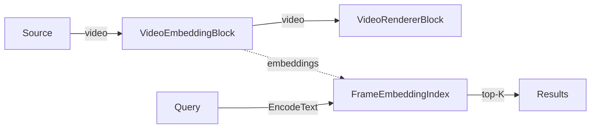

# VisioForge Media Blocks SDK .NET

## Semantic Video Search Demo (MAUI)

This cross-platform MAUI application indexes a video source (live camera or a picked file) into per-frame CLIP embeddings, then lets you find the moments that best match a natural-language query — for example "a red car", "a person waving", or "sunset over water". It uses the VisioForge Media Blocks SDK `VideoEmbeddingBlock` and a `FrameEmbeddingIndex`.

## How it works

A `VideoEmbeddingBlock` sits in the pipeline as a **passthrough**: it taps sampled frames (one per second by default), encodes each into an L2-normalized CLIP image embedding on a background worker, and appends it to a shared `FrameEmbeddingIndex` — the video itself is left unchanged and keeps rendering in the preview.

To search, the same block's CLIP **text** tower encodes your query into an embedding in the same space (`block.EncodeText`), and the index returns the top-10 frames by cosine similarity (`index.Search`). Results are listed as `timestamp + score + source`.

> Mobile v1 keeps it simple: results are shown as a list of timestamps and scores only — there is no thumbnail or seek-to-result preview (that exists in the desktop WPF demo).

## Features

- **Semantic search** over a live camera feed or a picked video file.
- **Cross-Platform**: Windows, Android, iOS, and macOS (Mac Catalyst).
- **CLIP ViT-B/32** dual-tower model (vision + text) via ONNX Runtime.
- **Persistable index**: Save the in-memory index to a `.vfei` file and Load it back later.
- **Live preview** of the source while indexing.

## Models

Model weights are **not** bundled with the app (they are large) — tap **DOWNLOAD MODELS** to fetch them at runtime. Four files are downloaded from the SDK samples release:

- `clip-vitb32-vision.onnx` — CLIP vision tower (image encoder, with projection)
- `clip-vitb32-text.onnx` — CLIP text tower (query encoder, with projection)
- `clip-vocab.json` — CLIP tokenizer vocabulary
- `clip-merges.txt` — CLIP tokenizer BPE merges

Download source: `https://github.com/visioforge/.Net-SDK-s-samples/releases/download/onnx-models-v2`

They are cached under the app data directory in `models/clip/` (`FileSystem.AppDataDirectory`), which is writable on every platform. A download is skipped when the file is already present with a plausible size.

## Requirements

- .NET 10
- Supported platforms:
  - Windows 10 (19041) or later
  - Android 7.0 (API 24) or later (ONNX Runtime's Android library requires minSdk 24)
  - iOS 15.0 or later
  - macOS 12.0 or later (via Mac Catalyst)
- VisioForge Media Blocks SDK + VisioForge.Core.AI

## How to Use

1. **Launch the app** and grant camera permission when prompted (required on mobile).
2. **Download models**: tap **DOWNLOAD MODELS** and wait for the four CLIP files to download.
3. **Choose a source**: tap **Source:** to toggle between the live **Camera** and a **Video file**.
   - Camera: tap **SELECT CAMERA** to cycle through available cameras.
   - Video file: tap **OPEN FILE** and pick a video.
4. **Start indexing**: tap **START**. The indexed-frame count updates live. For a file, indexing runs at decode speed and finishes at the end of the clip (the pipeline stays alive so you can keep searching).
5. **Search**: type a query (e.g. `a red car`) and tap **SEARCH**. The top-10 matching frames appear with their timestamp and similarity score.
6. **Save / Load / Clear** the index with the buttons at the bottom (index files use the `.vfei` format).
7. **Stop** with **STOP** when done.

> Note: **SEARCH** requires the pipeline to be running, because the CLIP text encoder is loaded together with the pipeline. Start a source before searching (even when searching a loaded index).

## Pipeline

```
[Camera or Video file source] -> [VideoEmbeddingBlock (passthrough)] -> [VideoRendererBlock]
```

- **Source**: `SystemVideoSourceBlock` (camera) or `UniversalSourceBlock` (file).
- **VideoEmbeddingBlock**: encodes sampled frames into CLIP embeddings, appends them to the `FrameEmbeddingIndex`, and provides `EncodeText` for queries. Passes video through untouched.
- **VideoRendererBlock**: displays the source preview (`IsSync = false`).



## Building and Running

### From Visual Studio

1. Open the solution in Visual Studio 2022.
2. Select your target platform (Windows, Android, iOS, etc.).
3. Build and run.

### From Command Line

```bash
# For Windows
dotnet build -f net10.0-windows10.0.19041.0

# For Android
dotnet build -f net10.0-android

# For iOS
dotnet build -f net10.0-ios

# For macOS (Mac Catalyst)
dotnet build -f net10.0-maccatalyst
```

## Supported Frameworks

- .NET 10

---

[Visit the product page.](https://www.visioforge.com/media-blocks-sdk)
