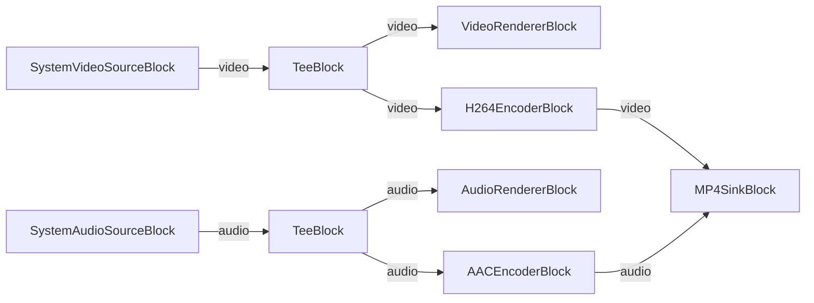

# Media Blocks SDK .Net - SimpleCapture (C#/MAUI)

Esta aplicación captura la salida de audio del sistema, guarda la salida en formato MP4, divide el flujo de video para múltiples salidas.

## Bloques de medios utilizados

* `SystemVideoSourceBlock` - Camera device capture
* `SystemAudioSourceBlock` - System audio capture
* `TeeBlock` - Stream splitting
* `VideoRendererBlock` - Real-time video display
* `AudioRendererBlock` - Real-time audio playback
* `H264EncoderBlock` - H.264/AVC video encoding
* `AACEncoderBlock` - AAC audio encoding
* `MP4SinkBlock` - MP4 file output

## Pipeline

## Frameworks soportados

* .Net 4.7.2
* .Net Core 3.1
* .Net 5
* .Net 6
* .Net 7
* .Net 8
* .Net 9
* .Net 10

---

[Visit the product page.](https://www.visioforge.com/media-blocks-sdk)
