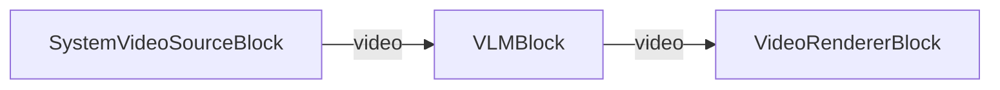

# VisioForge Media Blocks SDK .NET

## VLM Captioning Demo (MAUI)

This cross-platform MAUI application runs the Florence-2 vision-language model (VLM) on a live camera feed to caption frames, detect objects, read text (OCR), and ground phrases — using the VisioForge Media Blocks SDK and ONNX Runtime.

## Features

- **Vision-Language Model**: Runs Florence-2 (base) on the camera stream via `VLMBlock`.
- **8 Tasks**: Pick any Florence-2 task at runtime — Caption, Detailed Caption, More Detailed Caption, Object Detection, Dense Region Caption, OCR, OCR With Region, and Phrase Grounding.
- **Phrase Grounding Input**: For the Phrase Grounding task, type a caption to ground its phrases to image regions.
- **Live Overlay**: Grounded region boxes and a caption bar are drawn directly onto the video.
- **Cross-Platform**: Windows, Android, iOS, and macOS (Mac Catalyst).
- **Runtime Model Download**: Models are downloaded on first use (not bundled) and cached on device.

## Tasks

The task is selected from the picker and applied live (it takes effect on the next inference):

| Task | Output |
| ---- | ------ |
| Caption | One-sentence caption (text) |
| Detailed Caption | Longer caption (text) |
| More Detailed Caption | Paragraph-length caption (text) |
| Object Detection | Category label + box per object (regions) |
| Dense Region Caption | Short description + box per region (regions) |
| OCR | All text as a single string (text) |
| OCR With Region | Each text block + region (regions) |
| Phrase Grounding | Grounds the phrases of the `TextInput` caption to image regions (regions) — enter the caption in the text box |

## Models

The 7 Florence-2 base files are downloaded at runtime (they are too large to bundle) and cached under the app data directory:

- Cache folder: `<AppDataDirectory>/models/vlm`
- Files:
  - `florence2-base-vision-encoder.onnx`
  - `florence2-base-embed-tokens.onnx`
  - `florence2-base-encoder.onnx`
  - `florence2-base-decoder-merged.onnx`
  - `florence2-vocab.json`
  - `florence2-merges.txt`
  - `florence2-added-tokens.json`
- Download source: `https://github.com/visioforge/.Net-SDK-s-samples/releases/download/onnx-models-v2`

Tap **DOWNLOAD** once (about 500 MB total). Files already present with a plausible size are skipped, so a re-download only fetches what is missing. `VLMSettings(string modelFolder)` resolves all 7 files from the folder by their conventional names.

## Performance

Florence-2 is a full autoregressive generation per frame. **On CPU this is seconds per frame — that is expected.** The block runs inference on a background worker and throttles it with `VLMSettings.ProcessingInterval` (default 1 second), so live video is never stalled; frames between inferences reuse the most recent result. Raise `ProcessingInterval` for a lighter load. Florence-2 runs on CPU only — DirectML mis-executes its autoregressive decoder and returns garbage, so no GPU execution provider is exposed for this model.

## Requirements

- .NET 10
- Supported platforms:
  - Windows 10 (19041) or later
  - Android 7.0 (API 24) or later (ONNX Runtime's Android library requires minSdk 24)
  - iOS 15.0 or later
  - macOS 12.0 or later (via Mac Catalyst)
- VisioForge Media Blocks SDK + VisioForge.Core.AI
- Network access for the one-time model download

## How to Use

1. **Launch the Application**: Start the app on your device.
2. **Grant Camera Permission**: Allow camera access when prompted (required on mobile).
3. **Download Models**: Tap "DOWNLOAD" and wait for all 7 files (one time).
4. **Select Task**: Pick a Florence-2 task from the picker. For Phrase Grounding, type a caption in the text box.
5. **Select Camera** (optional): Tap "SELECT CAMERA" to cycle through available cameras.
6. **Start**: Tap "START" to begin. The latest caption / recognized text is shown below the controls; grounded regions are boxed on the live preview.
7. **Stop**: Tap "STOP" when done.

## Pipeline

```
[SystemVideoSourceBlock] → [VLMBlock] → [VideoRendererBlock]
```

- **SystemVideoSourceBlock**: Captures video from the camera.
- **VLMBlock**: Runs Florence-2 for the selected task, draws the overlay, and raises `OnResultGenerated`.
- **VideoRendererBlock**: Displays the annotated video preview.



## Building and Running

### From Visual Studio

1. Open the solution in Visual Studio 2022.
2. Select your target platform (Windows, Android, iOS, etc.).
3. Build and run.

### From Command Line

```bash
# For Windows
dotnet build -f net10.0-windows10.0.19041.0

# For Android
dotnet build -f net10.0-android

# For iOS
dotnet build -f net10.0-ios

# For macOS (Mac Catalyst)
dotnet build -f net10.0-maccatalyst
```

## Supported Frameworks

- .NET 10

---

[Visit the product page.](https://www.visioforge.com/media-blocks-sdk)
