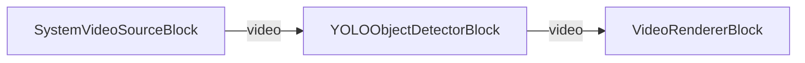

# VisioForge Media Blocks SDK .NET

## YOLO Object Detection Demo (MAUI)

This cross-platform MAUI application demonstrates real-time object detection on a live camera feed using the VisioForge Media Blocks SDK and an ONNX YOLO model.

## Features

- **Real-time Object Detection**: Detect objects in the camera stream and draw boxes/labels directly on the video.
- **Cross-Platform**: Works on Windows, Android, iOS, and macOS (Mac Catalyst).
- **Bundled Model**: Ships with `yolox_nano.onnx` (YOLOX family, Apache-2.0) — no download required.
- **Live Video Preview**: See the annotated camera feed while detecting.
- **Camera Selection**: Switch between multiple cameras if available.
- **Detection Status**: Shows the number of detections and the top object's label and confidence.

## Bundled Model

`Resources/Raw/yolox_nano.onnx` is a YOLOX-nano model (Megvii YOLOX, Apache-2.0). It is bundled as a MAUI asset and copied to the app data directory on first run so the ONNX runtime can read it from a real file path.

## Requirements

- .NET 10
- Supported platforms:
  - Windows 10 (19041) or later
  - Android 6.0 (API 23) or later
  - iOS 15.0 or later
  - macOS 12.0 or later (via Mac Catalyst)
- VisioForge Media Blocks SDK + VisioForge.Core.AI

## How to Use

1. **Launch the Application**: Start the app on your device.
2. **Grant Camera Permission**: Allow camera access when prompted (required on mobile).
3. **Select Camera** (optional): Tap "SELECT CAMERA" to cycle through available cameras.
4. **Start Detection**: Tap "START" to begin.
5. **Point the Camera**: Detected objects are boxed and labeled on the live preview; the status area shows the count and the top object's label and confidence.
6. **Stop Detection**: Tap "STOP" when done.

## Pipeline

```
[SystemVideoSourceBlock] → [YOLOObjectDetectorBlock] → [VideoRendererBlock]
```

- **SystemVideoSourceBlock**: Captures video from the camera.
- **YOLOObjectDetectorBlock**: Runs the YOLOX model, draws boxes/labels, and raises `OnObjectsDetected`.
- **VideoRendererBlock**: Displays the annotated video preview.



## Building and Running

### From Visual Studio

1. Open the solution in Visual Studio 2022.
2. Select your target platform (Windows, Android, iOS, etc.).
3. Build and run.

### From Command Line

```bash
# For Windows
dotnet build -f net10.0-windows10.0.19041.0

# For Android
dotnet build -f net10.0-android

# For iOS
dotnet build -f net10.0-ios

# For macOS (Mac Catalyst)
dotnet build -f net10.0-maccatalyst
```

## Supported Frameworks

- .NET 10

---

[Visit the product page.](https://www.visioforge.com/media-blocks-sdk)
