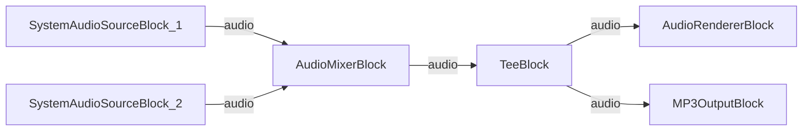

# Media Blocks SDK .Net - Audio Mixer (C#/WPF)

Esta aplicacion mezcla dos fuentes de audio con grabacion opcional a MP3.

## Bloques de medios utilizados

* `SystemAudioSourceBlock` - Captura de audio del sistema (x2)
* `AudioMixerBlock` - Mezcla de flujos de audio
* `TeeBlock` - Division de flujo de audio
* `AudioRendererBlock` - Reproduccion de audio en tiempo real
* `MP3OutputBlock` - Grabacion de archivo MP3

## Pipeline

## Frameworks soportados

* .Net 4.7.2
* .Net Core 3.1
* .Net 5
* .Net 6
* .Net 7
* .Net 8
* .Net 9
* .Net 10

---

[Visit the product page.](https://www.visioforge.com/media-blocks-sdk)
