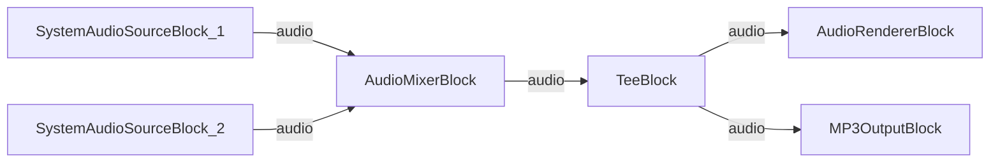

# Media Blocks SDK .Net - Audio Mixer (C#/WPF)

This application mixes two audio sources together with optional recording to MP3.

## Used media blocks

* `SystemAudioSourceBlock` - System audio capture (x2)
* `AudioMixerBlock` - Audio stream mixing
* `TeeBlock` - Audio stream splitting
* `AudioRendererBlock` - Real-time audio playback
* `MP3OutputBlock` - MP3 file recording

## Pipeline

## Supported frameworks

* .Net 4.7.2
* .Net Core 3.1
* .Net 5
* .Net 6
* .Net 7
* .Net 8
* .Net 9
* .Net 10

---

[Visit the product page.](https://www.visioforge.com/media-blocks-sdk)
