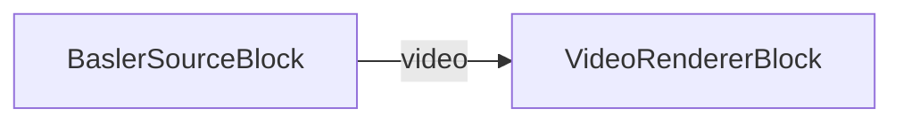

# Media Blocks SDK .Net - Basler Source Demo (C#/WPF)

Esta aplicacion captura y muestra video de camaras industriales Basler usando el SDK de Pylon.

## Bloques de medios utilizados

* `BaslerSourceBlock` - Captura de camara Basler
* `VideoRendererBlock` - Visualizacion de video en tiempo real

## Pipeline

## Frameworks soportados

* .Net 4.7.2
* .Net Core 3.1
* .Net 5
* .Net 6
* .Net 7
* .Net 8
* .Net 9
* .Net 10

---

[Visit the product page.](https://www.visioforge.com/media-blocks-sdk)
