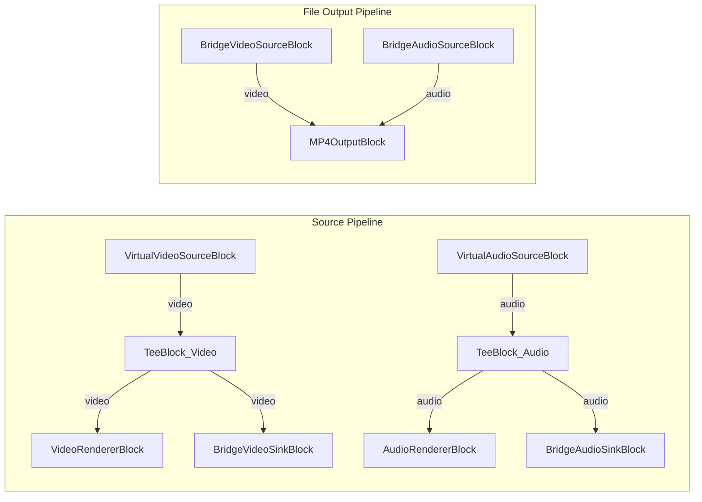

# Media Blocks SDK .Net - Bridge Demo (C#/WPF)

Esta aplicacion demuestra la comunicacion entre pipelines usando bloques bridge para transferir video y audio entre un pipeline fuente y un pipeline de salida a archivo.

## Bloques de medios utilizados

* `VirtualVideoSourceBlock` - Generacion de video sintetico
* `VirtualAudioSourceBlock` - Generacion de audio sintetico
* `TeeBlock` - Division de flujo (video y audio)
* `BridgeVideoSinkBlock` - Salida de bridge de video
* `BridgeVideoSourceBlock` - Entrada de bridge de video
* `BridgeAudioSinkBlock` - Salida de bridge de audio
* `BridgeAudioSourceBlock` - Entrada de bridge de audio
* `VideoRendererBlock` - Visualizacion de video en tiempo real
* `AudioRendererBlock` - Reproduccion de audio en tiempo real
* `MP4OutputBlock` - Grabacion de archivo MP4
* `H264EncoderBlock` - Codificacion de video H.264/AVC
* `AACEncoderBlock` - Codificacion de audio AAC

## Pipeline

## Frameworks soportados

* .Net 4.7.2
* .Net Core 3.1
* .Net 5
* .Net 6
* .Net 7
* .Net 8
* .Net 9
* .Net 10

---

[Visit the product page.](https://www.visioforge.com/media-blocks-sdk)
