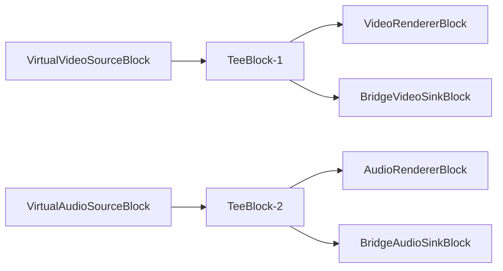
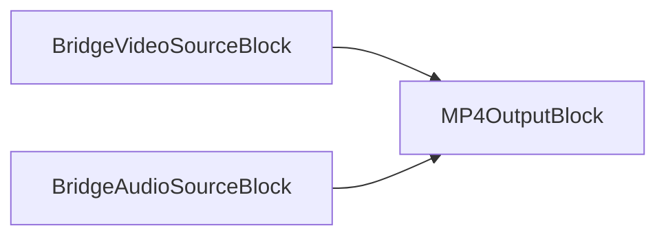

# Media Blocks SDK .Net - Bridge Demo (WPF)

SDK has bridges that allow video/audio streams to be sent from one pipeline to another. This demo will show you how to use them.

In the demo, you can see two pipelines: source and file output.

The source pipeline has video/audio sources, tees, renderers, and bridge sinks.

The output pipeline has bridge sources, video/audio encoders, and a muxer.

## Features

- Generate video/audio streams and save them as an MP4 file independently from the preview

## Used blocks

- [VideoRendererBlock](https://www.visioforge.com/help/docs/dotnet/mediablocks/VideoRendering/) - renders video
- [AudioRendererBlock](https://www.visioforge.com/help/docs/dotnet/mediablocks/AudioRendering/) - renders audio
- [TeeBlock](https://www.visioforge.com/help/docs/dotnet/mediablocks/Special/TeeBlock/) - splits the pipeline into multiple branches
- [BridgeVideoSinkBlock](https://www.visioforge.com/help/docs/dotnet/mediablocks/Bridge/BridgeVideoSinkBlock/) - sends video to another pipeline
- [BridgeAudioSinkBlock](https://www.visioforge.com/help/docs/dotnet/mediablocks/Bridge/BridgeAudioSinkBlock/) - sends audio to another pipeline
- [BridgeVideoSourceBlock](https://www.visioforge.com/help/docs/dotnet/mediablocks/Bridge/BridgeVideoSourceBlock/) - receives video from another pipeline
- [BridgeAudioSourceBlock](https://www.visioforge.com/help/docs/dotnet/mediablocks/Bridge/BridgeAudioSourceBlock/) - receives audio from another pipeline
- `MP4OutputBlock` - saves video/audio streams as an MP4 file

## Supported frameworks

- .Net 4.7.2
- .Net Core 3.1
- .Net 5
- .Net 6
- .Net 7
- .Net 8
- .Net 9

---

[Media Blocks SDK .Net product page](https://www.visioforge.com/media-blocks-sdk)
