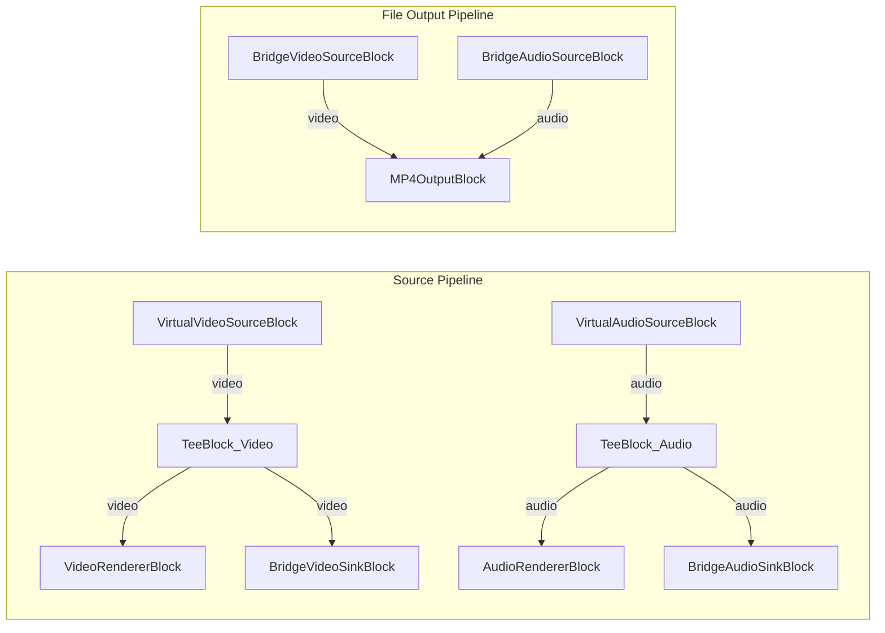

# Media Blocks SDK .Net - Bridge Demo (C#/WPF)

This application demonstrates cross-pipeline communication using bridge blocks to transfer video and audio between a source pipeline and a file output pipeline.

## Used media blocks

* `VirtualVideoSourceBlock` - Synthetic video generation
* `VirtualAudioSourceBlock` - Synthetic audio generation
* `TeeBlock` - Stream splitting (video and audio)
* `BridgeVideoSinkBlock` - Video bridge output
* `BridgeVideoSourceBlock` - Video bridge input
* `BridgeAudioSinkBlock` - Audio bridge output
* `BridgeAudioSourceBlock` - Audio bridge input
* `VideoRendererBlock` - Real-time video display
* `AudioRendererBlock` - Real-time audio playback
* `MP4OutputBlock` - MP4 file recording
* `H264EncoderBlock` - H.264/AVC video encoding
* `AACEncoderBlock` - AAC audio encoding

## Pipeline

```mermaid
graph LR
    subgraph Source Pipeline
        VirtualVideoSourceBlock -- video --> TeeBlock_Video
        TeeBlock_Video -- video --> VideoRendererBlock
        TeeBlock_Video -- video --> BridgeVideoSinkBlock
        VirtualAudioSourceBlock -- audio --> TeeBlock_Audio
        TeeBlock_Audio -- audio --> AudioRendererBlock
        TeeBlock_Audio -- audio --> BridgeAudioSinkBlock
    end
    subgraph File Output Pipeline
        BridgeVideoSourceBlock -- video --> MP4OutputBlock
        BridgeAudioSourceBlock -- audio --> MP4OutputBlock
    end
```

## Supported frameworks

* .Net 4.7.2
* .Net Core 3.1
* .Net 5
* .Net 6
* .Net 7
* .Net 8
* .Net 9
* .Net 10

---

[Visit the product page.](https://www.visioforge.com/media-blocks-sdk)
