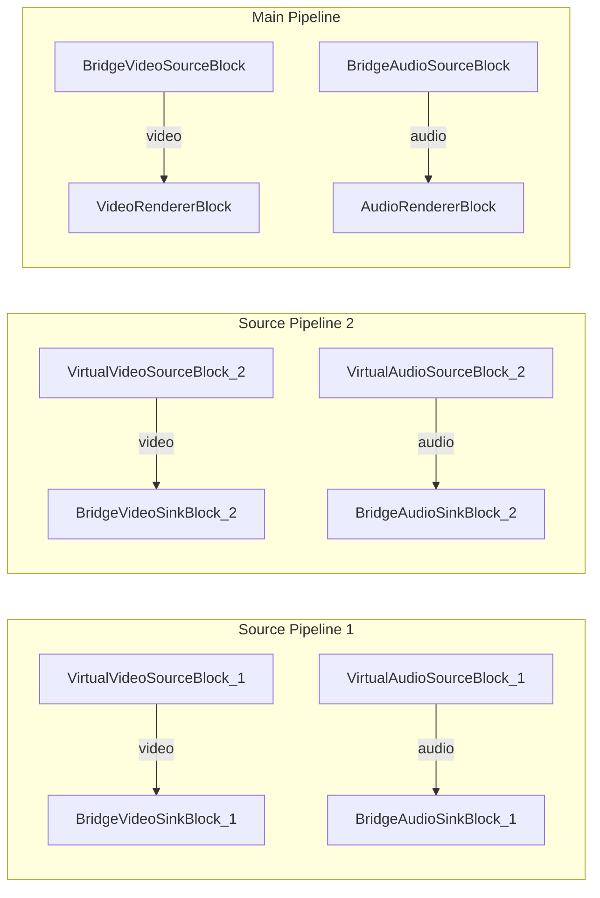

# Media Blocks SDK .Net - Bridge Source Switch (C#/WPF)

Esta aplicacion demuestra el cambio entre dos pipelines fuente en tiempo de ejecucion usando bloques bridge para transiciones fluidas de video y audio.

## Bloques de medios utilizados

* `VirtualVideoSourceBlock` - Generacion de video sintetico (x2)
* `VirtualAudioSourceBlock` - Generacion de audio sintetico (x2)
* `BridgeVideoSinkBlock` - Salida de bridge de video (x2)
* `BridgeVideoSourceBlock` - Entrada de bridge de video
* `BridgeAudioSinkBlock` - Salida de bridge de audio (x2)
* `BridgeAudioSourceBlock` - Entrada de bridge de audio
* `VideoRendererBlock` - Visualizacion de video en tiempo real
* `AudioRendererBlock` - Reproduccion de audio en tiempo real

## Pipeline

## Frameworks soportados

* .Net 4.7.2
* .Net Core 3.1
* .Net 5
* .Net 6
* .Net 7
* .Net 8
* .Net 9
* .Net 10

---

[Visit the product page.](https://www.visioforge.com/media-blocks-sdk)
