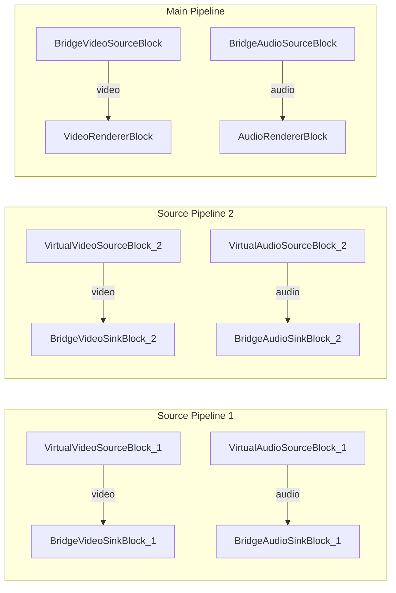

# Media Blocks SDK .Net - Bridge Source Switch (C#/WPF)

This application demonstrates switching between two source pipelines at runtime using bridge blocks for seamless video and audio source transitions.

## Used media blocks

* `VirtualVideoSourceBlock` - Synthetic video generation (x2)
* `VirtualAudioSourceBlock` - Synthetic audio generation (x2)
* `BridgeVideoSinkBlock` - Video bridge output (x2)
* `BridgeVideoSourceBlock` - Video bridge input
* `BridgeAudioSinkBlock` - Audio bridge output (x2)
* `BridgeAudioSourceBlock` - Audio bridge input
* `VideoRendererBlock` - Real-time video display
* `AudioRendererBlock` - Real-time audio playback

## Pipeline

## Supported frameworks

* .Net 4.7.2
* .Net Core 3.1
* .Net 5
* .Net 6
* .Net 7
* .Net 8
* .Net 9
* .Net 10

---

[Visit the product page.](https://www.visioforge.com/media-blocks-sdk)
