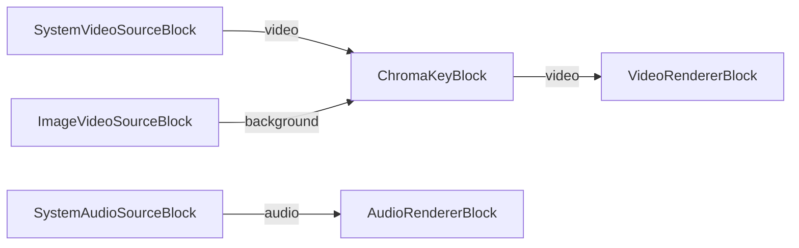

# Media Blocks SDK .Net - ChromaKey (C#/WPF)

Esta aplicacion aplica composicion de croma (pantalla verde) en tiempo real, combinando una fuente de camara o archivo de video con una imagen de fondo.

## Bloques de medios utilizados

* `SystemVideoSourceBlock` - Captura de camara del sistema
* `UniversalSourceBlock` - Reproduccion universal de archivos multimedia (fuente alternativa)
* `ImageVideoSourceBlock` - Fuente de imagen de fondo
* `ChromaKeyBlock` - Composicion de croma
* `SystemAudioSourceBlock` - Captura de audio del sistema
* `VideoRendererBlock` - Visualizacion de video en tiempo real
* `AudioRendererBlock` - Reproduccion de audio en tiempo real

## Pipeline

## Frameworks soportados

* .Net 4.7.2
* .Net Core 3.1
* .Net 5
* .Net 6
* .Net 7
* .Net 8
* .Net 9
* .Net 10

---

[Visit the product page.](https://www.visioforge.com/media-blocks-sdk)
