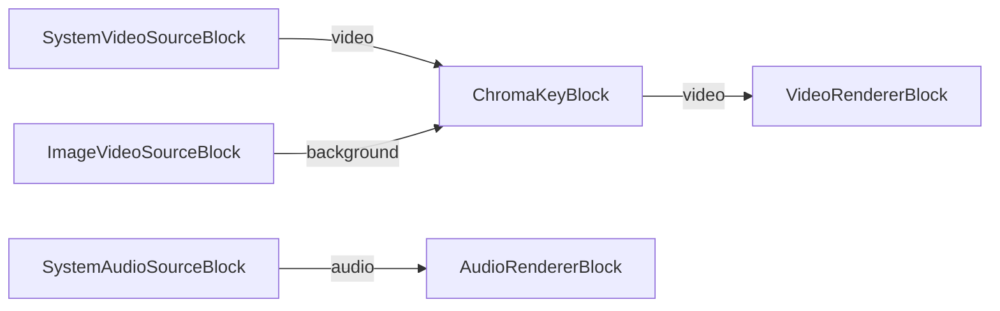

# Media Blocks SDK .Net - ChromaKey (C#/WPF)

This application applies real-time chroma key (green screen) compositing, combining a camera or video file source with a background image.

## Used media blocks

* `SystemVideoSourceBlock` - System camera capture
* `UniversalSourceBlock` - Universal media file playback (alternative source)
* `ImageVideoSourceBlock` - Background image source
* `ChromaKeyBlock` - Chroma key compositing
* `SystemAudioSourceBlock` - System audio capture
* `VideoRendererBlock` - Real-time video display
* `AudioRendererBlock` - Real-time audio playback

## Pipeline

## Supported frameworks

* .Net 4.7.2
* .Net Core 3.1
* .Net 5
* .Net 6
* .Net 7
* .Net 8
* .Net 9
* .Net 10

---

[Visit the product page.](https://www.visioforge.com/media-blocks-sdk)
