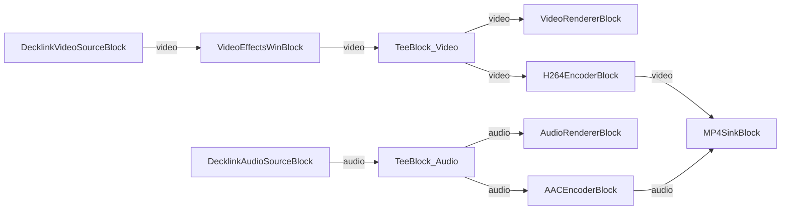

# Media Blocks SDK .Net - Decklink Demo (C#/WPF)

Esta aplicacion captura video y audio de hardware Decklink con vista previa, grabacion opcional a archivo, efectos de video y salida Decklink.

## Bloques de medios utilizados

* `DecklinkVideoSourceBlock` - Captura de video Decklink
* `DecklinkAudioSourceBlock` - Captura de audio Decklink
* `UniversalSourceBlock` - Reproduccion universal de archivos multimedia (fuente alternativa)
* `VideoEffectsWinBlock` - Procesamiento de efectos de video
* `TeeBlock` - Division de flujo (video y audio)
* `VideoRendererBlock` - Visualizacion de video en tiempo real
* `AudioRendererBlock` - Reproduccion de audio en tiempo real
* `VideoResizeBlock` - Redimensionamiento de video
* `H264EncoderBlock` - Codificacion de video H.264/AVC
* `AACEncoderBlock` - Codificacion de audio AAC
* `MP4SinkBlock` - Salida de archivo MP4
* `DecklinkVideoSinkBlock` - Salida de video Decklink
* `DecklinkAudioSinkBlock` - Salida de audio Decklink

## Pipeline

## Frameworks soportados

* .Net 4.7.2
* .Net Core 3.1
* .Net 5
* .Net 6
* .Net 7
* .Net 8
* .Net 9
* .Net 10

---

[Visit the product page.](https://www.visioforge.com/media-blocks-sdk)
