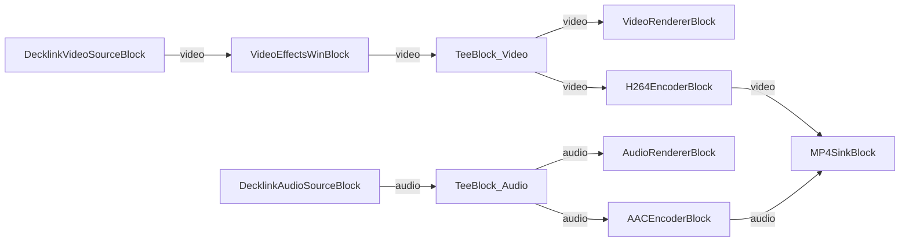

# Media Blocks SDK .Net - Decklink Demo (C#/WPF)

This application captures video and audio from Decklink hardware with preview, optional file recording, video effects, and Decklink output.

## Used media blocks

* `DecklinkVideoSourceBlock` - Decklink video capture
* `DecklinkAudioSourceBlock` - Decklink audio capture
* `UniversalSourceBlock` - Universal media file playback (alternative source)
* `VideoEffectsWinBlock` - Video effects processing
* `TeeBlock` - Stream splitting (video and audio)
* `VideoRendererBlock` - Real-time video display
* `AudioRendererBlock` - Real-time audio playback
* `VideoResizeBlock` - Video resize
* `H264EncoderBlock` - H.264/AVC video encoding
* `AACEncoderBlock` - AAC audio encoding
* `MP4SinkBlock` - MP4 file output
* `DecklinkVideoSinkBlock` - Decklink video output
* `DecklinkAudioSinkBlock` - Decklink audio output

## Pipeline

## Supported frameworks

* .Net 4.7.2
* .Net Core 3.1
* .Net 5
* .Net 6
* .Net 7
* .Net 8
* .Net 9
* .Net 10

---

[Visit the product page.](https://www.visioforge.com/media-blocks-sdk)
