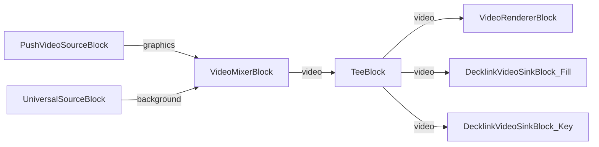

# Media Blocks SDK .Net - Decklink Fill-Key Demo (C#/WPF)

This application demonstrates real-time broadcast graphics with Decklink Fill+Key output, combining WPF-generated graphics with video backgrounds for professional broadcast overlays.

## Used media blocks

* `PushVideoSourceBlock` - Graphics frame push source
* `UniversalSourceBlock` - Video file background source
* `VideoMixerBlock` - Video compositing
* `TeeBlock` - Stream splitting for preview and dual output
* `VideoRendererBlock` - Real-time video preview
* `DecklinkVideoSinkBlock` - Decklink Fill and Key video outputs

## Pipeline

## Supported frameworks

* .Net 4.7.2
* .Net Core 3.1
* .Net 5
* .Net 6
* .Net 7
* .Net 8
* .Net 9
* .Net 10

---

[Visit the product page.](https://www.visioforge.com/media-blocks-sdk)
