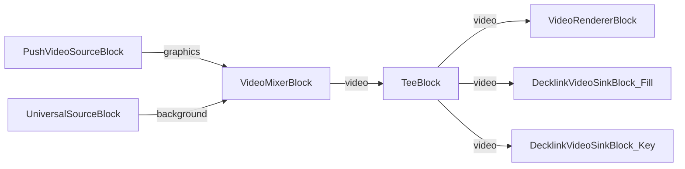

# Media Blocks SDK .Net - Decklink Fill-Key Demo (C#/WPF)

Esta aplicación demuestra gráficos de transmisión en tiempo real con salida Decklink Fill+Key, combinando gráficos generados por WPF con fondos de video para superposiciones de transmisión profesional.

## Bloques de medios utilizados

* `PushVideoSourceBlock` - Fuente de fotogramas gráficos
* `UniversalSourceBlock` - Fuente de video de fondo
* `VideoMixerBlock` - Composición de video
* `TeeBlock` - División de flujo para vista previa y salida dual
* `VideoRendererBlock` - Vista previa de video en tiempo real
* `DecklinkVideoSinkBlock` - Salidas de video Decklink Fill y Key

## Pipeline

## Frameworks soportados

* .Net 4.7.2
* .Net Core 3.1
* .Net 5
* .Net 6
* .Net 7
* .Net 8
* .Net 9
* .Net 10

---

[Visit the product page.](https://www.visioforge.com/media-blocks-sdk)
