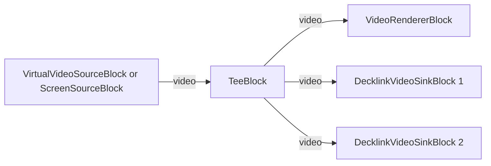

# Media Blocks SDK .Net - Decklink MultiOutput (C#/WPF)

This application generates synthetic video frames for testing and benchmarking, captures desktop/screen content, splits video stream for multiple outputs.

## Used media blocks

* `VirtualVideoSourceBlock` - Synthetic video generation
* `ScreenSourceBlock` - Desktop screen capture
* `TeeBlock` - Stream splitting
* `VideoRendererBlock` - Real-time video display

## Pipeline

## Supported frameworks

* .Net 4.7.2
* .Net Core 3.1
* .Net 5
* .Net 6
* .Net 7
* .Net 8
* .Net 9
* .Net 10

---

[Visit the product page.](https://www.visioforge.com/media-blocks-sdk)
