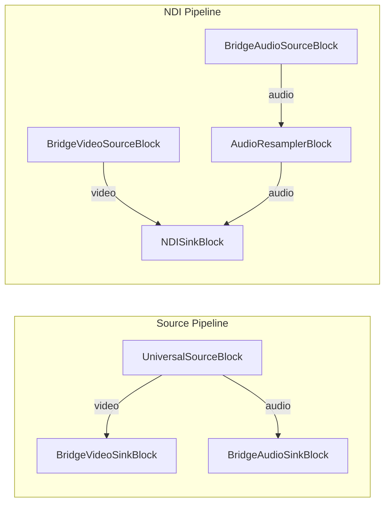

# Media Blocks SDK .Net - File to NDI Demo (C#/WPF)

Esta aplicación reproduce un archivo multimedia y lo transmite a través de la red utilizando el protocolo NDI. Utiliza una arquitectura de puente de dos pipelines para garantizar una reproducción fluida con soporte de búsqueda.

## Bloques de medios utilizados

* `UniversalSourceBlock` - Reproducción de archivos multimedia
* `BridgeVideoSinkBlock` / `BridgeVideoSourceBlock` - Puente de video entre pipelines
* `BridgeAudioSinkBlock` / `BridgeAudioSourceBlock` - Puente de audio entre pipelines
* `AudioResamplerBlock` - Remuestreo de audio
* `NDISinkBlock` - Salida de red NDI

## Pipeline

## Frameworks soportados

* .Net 8
* .Net 9
* .Net 10

---

[Visit the product page.](https://www.visioforge.com/media-blocks-sdk)
