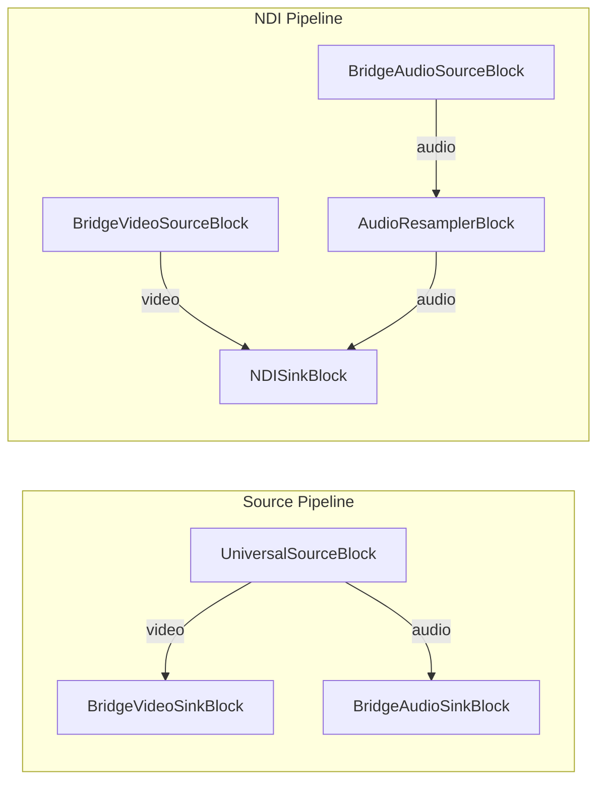

# Media Blocks SDK .Net - File to NDI Demo (C#/WPF)

This application plays a media file and streams it over the network using the NDI protocol. It uses a two-pipeline bridge architecture to ensure smooth playback with seeking support.

## Used media blocks

* `UniversalSourceBlock` - Media file playback
* `BridgeVideoSinkBlock` / `BridgeVideoSourceBlock` - Video bridge between pipelines
* `BridgeAudioSinkBlock` / `BridgeAudioSourceBlock` - Audio bridge between pipelines
* `AudioResamplerBlock` - Audio resampling
* `NDISinkBlock` - NDI network output

## Pipeline

## Supported frameworks

* .Net 8
* .Net 9
* .Net 10

---

[Visit the product page.](https://www.visioforge.com/media-blocks-sdk)
