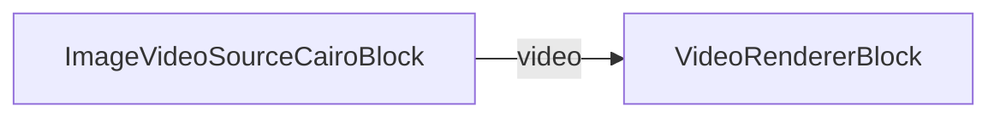

# ImageVideoSourceCairo Demo

This demo application showcases the `ImageVideoSourceCairo` block, which provides dynamic image switching capabilities without stopping the GStreamer pipeline. It uses Cairo overlay for real-time image rendering with support for different display modes.

## Features

- **Dynamic Image Switching**: Switch between 4 different images (PNG, JPG, GIF, BMP) without pipeline restarts
- **Display Modes**:
  - **Stretch**: Stretches the image to fill the entire video frame
  - **Letterbox**: Maintains aspect ratio and centers the image with black bars
  - **Original Size**: Displays the image at its original resolution (centered)
- **Live Pipeline**: Images update in real-time while the video pipeline continues running
- **Format Support**: Supports various image formats including PNG, JPEG, GIF, and BMP

## Requirements

Before running the demo, you need to provide 4 test images in the application's output directory:
- `image1.png`
- `image2.jpg`
- `image3.gif`
- `image4.bmp`

These images can have different resolutions to test the display modes effectively.

## How It Works

1. **Pipeline Setup**: Creates a MediaBlocks pipeline with an `ImageVideoSourceCairoBlock` as the source
2. **Cairo Overlay**: Uses GStreamer's `cairooverlay` element to draw images dynamically
3. **Dynamic Updates**: The `UpdateFilename()` method changes the displayed image without stopping the pipeline
4. **Display Modes**: The Cairo drawing context handles scaling and positioning based on the selected mode

## Code Structure

- **ImageVideoSourceCairo**: Core implementation using Cairo for dynamic image rendering
- **ImageVideoSourceCairoBlock**: MediaBlocks wrapper for easy integration
- **MainWindow**: WPF UI demonstrating the functionality

## Key Methods

```csharp
// Switch to a different image
_imageSource.UpdateFilename(newImagePath);

// Change display mode
_imageSource.SetDisplayMode(ImageVideoSourceCairo.ImageDisplayMode.Letterbox);
```

## Technical Details

- Uses `videotestsrc` as the base with a black pattern
- Applies `cairooverlay` for dynamic image drawing
- Includes `imagefreeze` to maintain consistent frame rate
- Supports hardware-accelerated rendering when available

## Display Modes Explained

### Stretch Mode
- Scales the image non-uniformly to fill the entire frame
- May distort the image if aspect ratios don't match
- Best for when you want to use all available space

### Letterbox Mode (Default)
- Scales the image uniformly to fit within the frame
- Maintains original aspect ratio
- Adds black bars (letterboxing) as needed
- Best for preserving image quality and proportions

### Original Size Mode
- Displays the image at its native resolution
- Centers the image in the frame
- May crop the image if it's larger than the frame
- Best for pixel-perfect display of smaller images

## Pipeline



## Performance Notes

- Cairo-based rendering is efficient for dynamic updates
- No pipeline restarts mean smooth transitions
- Suitable for applications requiring frequent image changes
- Memory efficient as only one image is loaded at a time

## Supported frameworks

* .Net 4.7.2
* .Net Core 3.1
* .Net 5
* .Net 6
* .Net 7
* .Net 8
* .Net 9
* .Net 10

---

[Visit the product page.](https://www.visioforge.com/media-blocks-sdk)