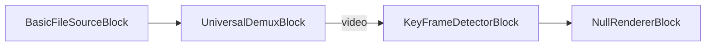

# Media Blocks SDK .Net - Key Frame Detector (C#/WPF)

Esta aplicación detecta fotogramas clave en archivos de video y guarda las marcas de tiempo en JSON.

## Bloques de medios utilizados

* `BasicFileSourceBlock` - File source
* `UniversalDemuxBlock` - Media demuxer
* `KeyFrameDetectorBlock` - Key frame detection
* `NullRendererBlock` - Null output sink

## Pipeline

## Frameworks soportados

* .Net 4.7.2
* .Net Core 3.1
* .Net 5
* .Net 6
* .Net 7
* .Net 8
* .Net 9
* .Net 10

---

[Visit the product page.](https://www.visioforge.com/media-blocks-sdk)
