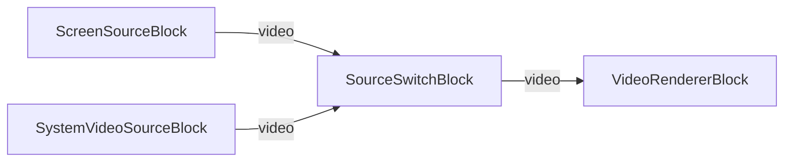

# Media Blocks SDK .Net - Live Source Switch Demo (C#/WPF)

Esta aplicación captura contenido de escritorio/pantalla.

## Bloques de medios utilizados

* `ScreenSourceBlock` - Desktop screen capture
* `SystemVideoSourceBlock` - Webcam video capture
* `SourceSwitchBlock` - Live source switching
* `VideoRendererBlock` - Real-time video display

## Pipeline

## Frameworks soportados

* .Net 4.7.2
* .Net Core 3.1
* .Net 5
* .Net 6
* .Net 7
* .Net 8
* .Net 9
* .Net 10

---

[Visit the product page.](https://www.visioforge.com/media-blocks-sdk)
